# 事前準備 {#intro}

## 引言

應用於實體電腦之前，我們會在虛擬機器內先執行過一遍，確認操作沒問題後，才會在實體點腦上操作。這裡我選用 VirtualBox 作為示範。

## 安裝 VirtualBox

{.figure}

先到 [VirtualBox 官方網站](https://www.virtualbox.org/wiki/Downloads)的下載頁面，下載適合你電腦系統的安裝執行檔，假如是 Windows 系統就點擊 「Windows hosts」的下載連結，如果是其他作業系統就根據你的作業系統下載對應的檔案。

{.figure}

安裝的過程中只需使用預設的設定即可，預設設定做了安裝虛擬機器的驅動程式、關聯檔案...等等，正常安裝不需要變更它。

## 於虛擬機器安裝作業系統

再安裝完 VirtualBox 後，打開並不會有預先安裝好的作業系統，需要在 VirtualBox 內自行安裝作業系統。首先介紹 VirtualBox 的使用者介面:

```{r virtualbox-menu, fig.align='center', fig.cap='VirtualBox 的操作介面', echo=FALSE}
knitr::include_graphics("./figures/virtualbox-menu.png", dpi = NA)
```

如 \@ref(fig:virtualbox-menu) 所示，右邊主要功能圖示由左而右的功能分別是:

1.  `喜好設定`: 設定 VirtualBox 的整體設定，像是軟體語言、虛擬機器預設存放位置...等等
2.  `匯入`: 匯入虛擬機器檔案 (.ovf)
3.  `匯出`: 匯出虛擬機器檔案
4.  `新增`: 新增*新的*虛擬主機
5.  `加入`: 加入*已經存在的*虛擬主機

### 新增 Ubuntu 作業系統設定

所以要新增新的虛擬機器是按「新增」。

{.figure}

這裡先點選「專家模式」，專家模式可以一併設定虛擬機器的所有設定。

{.figure}

記憶體大小根據每個人電腦的性能做調整，虛擬主機沒用來做什麼事最多4Gb (4 \* 1024Mb) 就很夠用了。這裡要注意的一點是，虛擬機器的存放位置，當你要轉移虛擬機器時才不會找不到。

預設的虛擬機器存放位置位於使用者資料夾中的`Virtual VMs`資料夾，像我的使用者是qaz85，那虛擬機器就位於:

    C:\Users\qaz85\VirtualBox VMs

從這張圖可以看到院伺服器的磁碟配置是由兩個 1Tb 的硬碟組成，且用[Raid-1](http://linux.vbird.org/linux_basic/0420quota.php#raid1) (映射模式) 將伺服器同時映射備份至另一個硬碟。

``` {.bash}
$ lsblk
NAME                       MAJ:MIN RM   SIZE RO TYPE   MOUNTPOINT
sdb                          8:16   0 931.5G  0 disk
├─sdb2                       8:18   0 852.5G  0 part
├─sdb3                       8:19   0    32G  0 part
├─sdb1                       8:17   0   512M  0 part
└─isw_ecbbadhihd_Raid1     253:0    0   885G  0 dmraid
  ├─isw_ecbbadhihd_Raid1p1 253:1    0   512M  0 part   /boot/efi
  ├─isw_ecbbadhihd_Raid1p2 253:2    0 852.5G  0 part   /
  └─isw_ecbbadhihd_Raid1p3 253:3    0    32G  0 part   [SWAP]
sr0                         11:0    1  1024M  0 rom
sda                          8:0    0 931.5G  0 disk
├─sda2                       8:2    0 852.5G  0 part
├─sda3                       8:3    0    32G  0 part
├─sda1                       8:1    0   512M  0 part
└─isw_ecbbadhihd_Raid1     253:0    0   885G  0 dmraid
  ├─isw_ecbbadhihd_Raid1p1 253:1    0   512M  0 part   /boot/efi
  ├─isw_ecbbadhihd_Raid1p2 253:2    0 852.5G  0 part   /
  └─isw_ecbbadhihd_Raid1p3 253:3    0    32G  0 part   [SWAP]
```

{.figure}

所以這裡也選擇跟院伺服器一樣的1000Gb做為系統硬碟，類型與版本記得設定為 Linux 與 Ubuntu 64位元 版本。完成之後點擊「建立」。

這裡我會選 VMDK 格式的原因是因為，如果要轉移虛擬主機檔案時，單一個檔案會輕易地超過 4Gb，而超過此上限得檔案在複製時，如果目的地的裝置格式不是 ntfs 的話，會沒有辦法複製。為了預防這個問題，我在這邊先選擇 VMDK 作為我虛擬主機的檔案格式。

::: {.infobox .info}
這裡如果選擇「固定大小」會新增一個跟你設定的檔案大小一樣大的虛擬機器檔案，除非你的硬碟很大，否則不建議這麼做。
:::

<!--# TODO: 這邊可以再加如果虛擬主機已經是 VDI 格式怎麼轉換成 VMDK 格式的教學 -->

{.figure}

完成後，會在 Virtual Machine 的選單左邊看見剛剛新建的虛擬機器，不過此時的虛擬機器內還沒有作業系統。

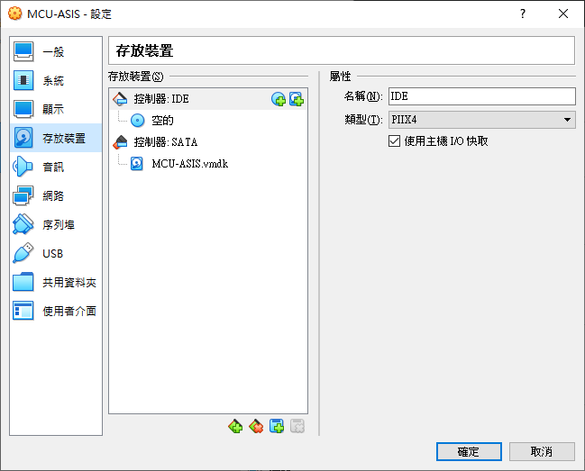

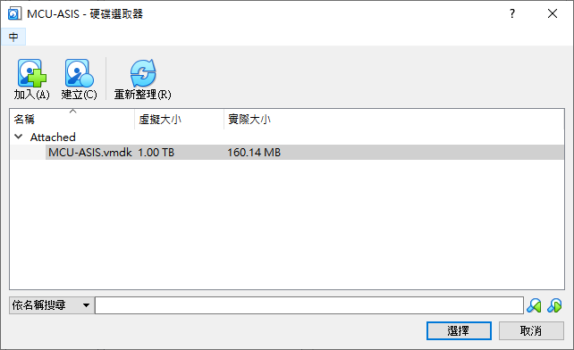

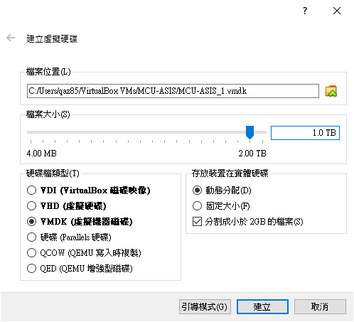

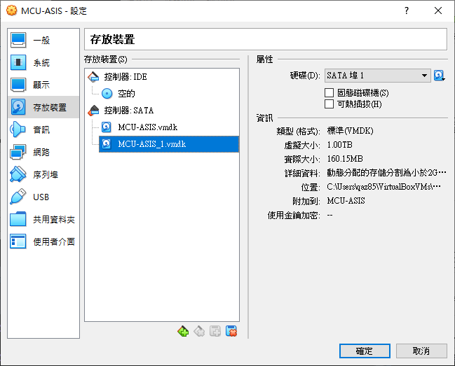

### 於 VirtualBox 安裝作業系統

在安裝作業系統之前，要先下載作業系統，因為目前的院伺服器系統是 Ubuntu 、我自己的 VPS 也是 Ubuntu ，而且我摸得比較熟的也是 Ubuntu 那有什麼理由換掉呢？所以這裡我也以 Ubuntu 作為我們院伺服器主要的系統。

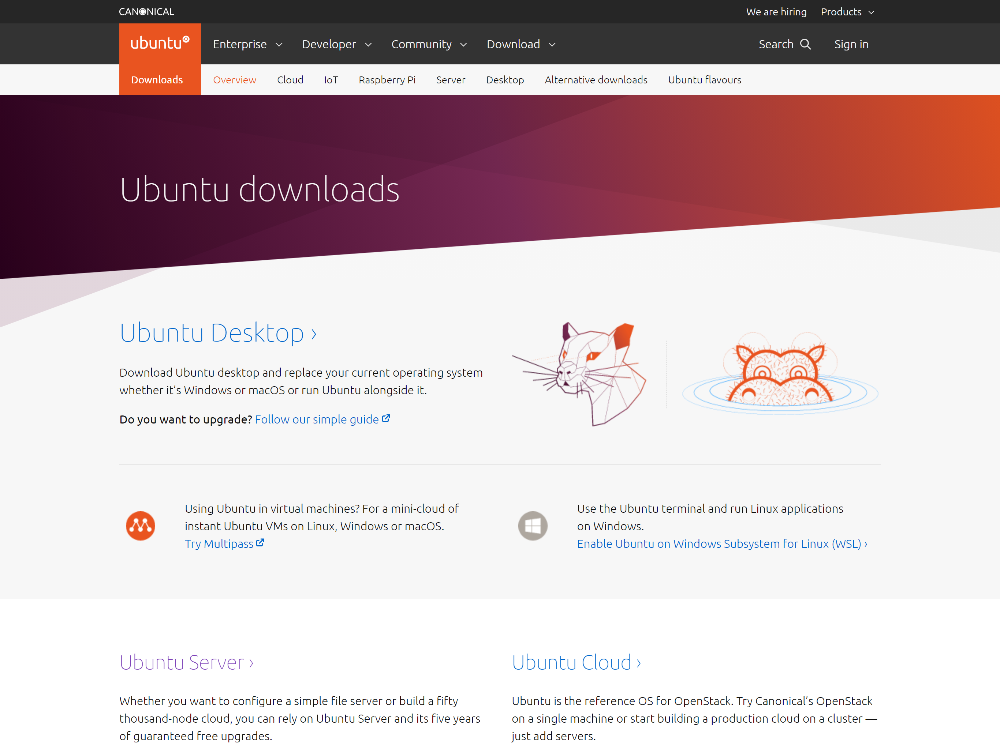{.figure}

進到 Ubuntu 官方網站的下載介面，這次我們選擇伺服器版本 (Ubuntu Server) 代替以往的桌面版本 (Ubuntu Desktop)。因為如果是伺服器，不需要圖形介面就可以管理了，相對於桌面版本也較節省資源。

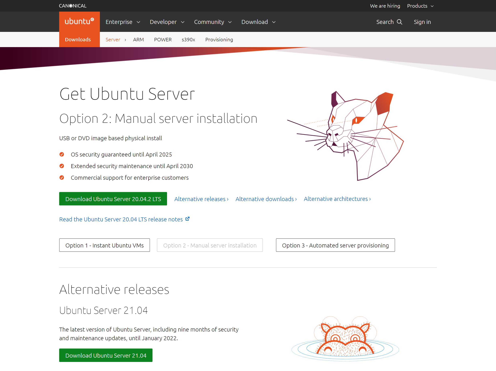{.figure}

選擇「Option 2 - Manual server Installation」選項之後，按上面的綠色按鈕「Download Ubuntu Server 20.04.2 LTS」會跳轉到下載頁面，開始下載 Ubuntu 系統映像檔案 (\*.iso)。

其他選項的簡易說明:

-   `Option 1 - Instant Ubuntu VMs`: Multipass 是快速部屬虛擬機器的軟體，詳細說明可以看[這裡](https://github.com/canonical/multipass)，而這裡我們已經選用 VirtualBox 了所以不會用到

-   `Option 2 - Manual server installation`: 傳統的下載映像檔案

-   `Option 3 - Automated server provisioning`: 利用 [MaaS](https://maas.io/) (Metal-as-a-Service) 安裝虛擬機。MaaS是管理數台虛擬主機用的服務，並不局限於 Ubuntu，Windows、CentOS 與 ESXi都可以在上面部屬。

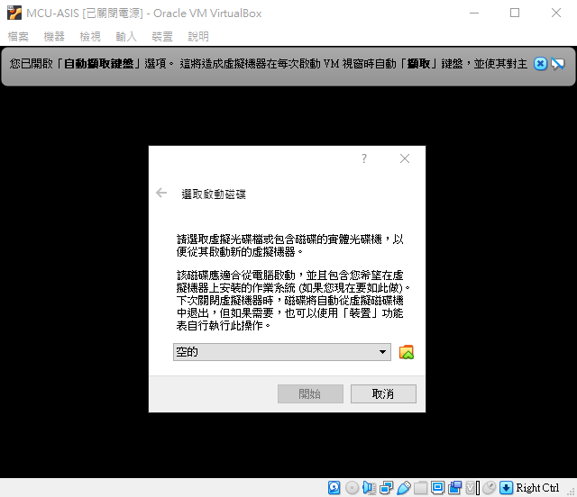{.figure}

待下載完成後，開啟剛剛創建的「MCU-ASIS」虛擬主機，會跳出一個選擇啟動磁碟的訊息提示視窗，這裡我們點擊右下角的資料夾📁。

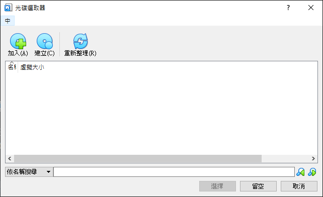{.figure}

按「加入」並選擇剛剛下載下來的映像檔案 (ubuntu-20.04.2-live-server-amd64.iso)。加入完成後按「選擇」，接著按「開始」掛載映像檔案至虛擬主機中開始安裝。

#### 語言

{.figure}

稍待 Ubuntu 作業系統映像檔載入後，安裝程式會跳出選擇語言的畫面，在這裡選擇適合你的語言。

在安裝過程中使用方向鍵⬆️⬇️⬅️➡️ (選擇)、Enter↪️ (確認) 與 Esc (返回) 操控安裝程式介面。

#### 鍵盤配置


這裡可以設定鍵盤的:

-   `Layout` (布局): 鍵盤的語言

-   `Variant` (鍵位): 一般在台灣都是用 QWERTY 配置，詳細說明可以在[這](https://zh.wikipedia.org/wiki/%E9%94%AE%E7%9B%98%E5%B8%83%E5%B1%80)找到

#### 網路連線

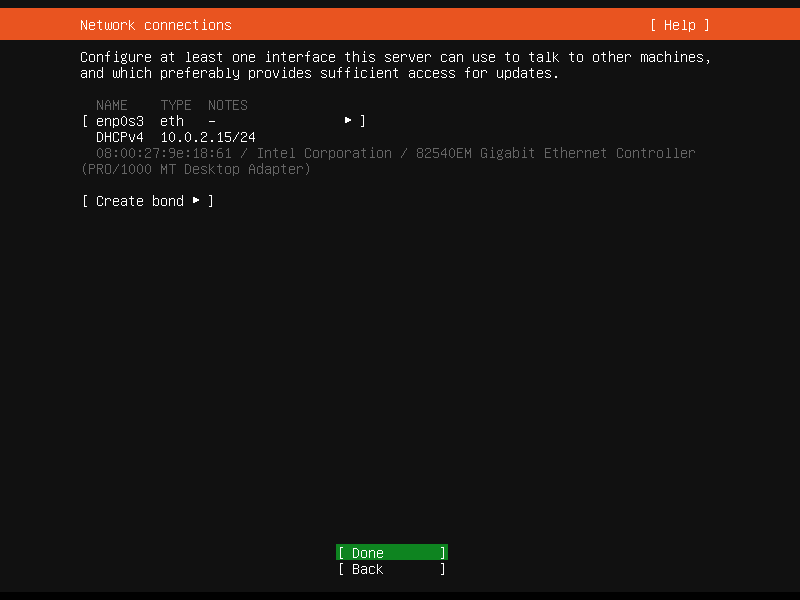

這裡可以設定 Ubuntu 的網路連線，預設是由 DHCP 設定，通常不用變更，如果這裡連線失敗，也可以等開機後再做設定。

#### Proxy

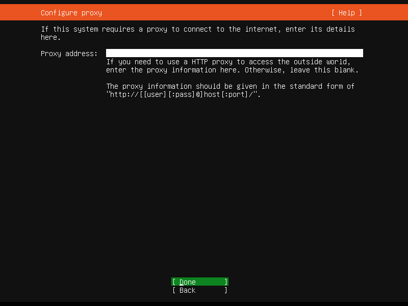

除非網路需要設定 proxy (代理伺服器)，否則不需要設定。

#### 鏡像 (Mirror)

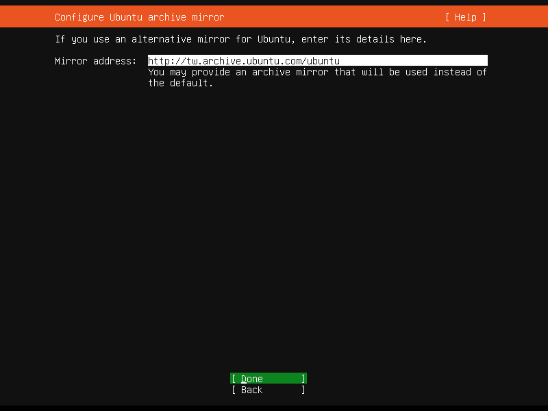

同上，不需要特別設定 mirror (鏡像)，安裝程式會自動判斷選擇哪個地方的鏡像網址更新。

#### 安裝程式更新 (可能不會出現)

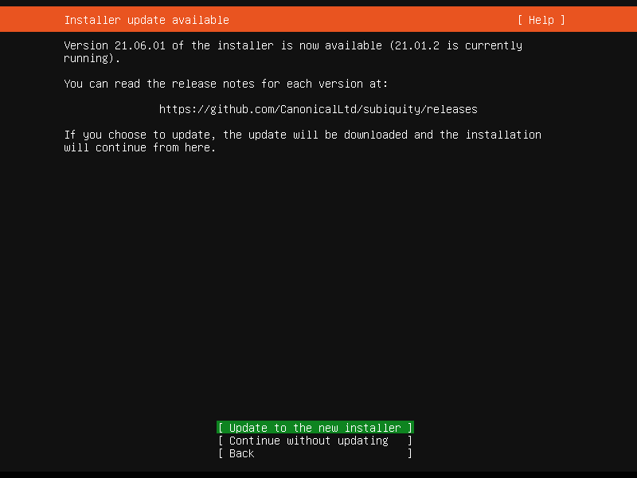

如果出現了這個畫面代表安裝程式有新的版本，可以在安裝時順便更新，當然，也可以在系統安裝完後更新。

#### 系統空間配置 (Raid-1)

<!--# TODO: 補充前言 -->

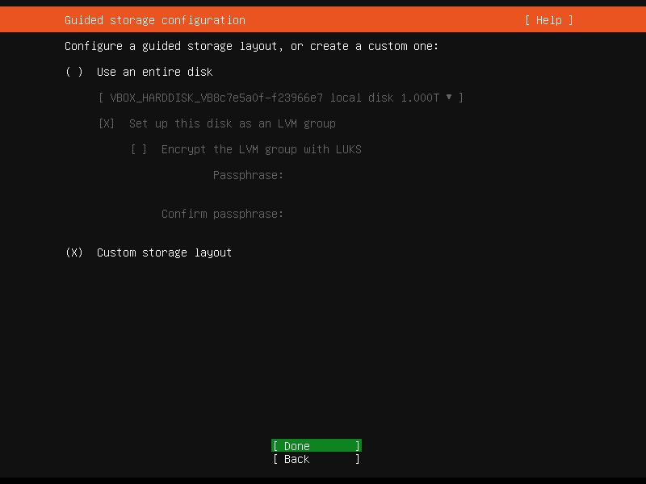

這裡選擇下面的「Custom storage layout」。以下 Raid-1 相關的設定是參考 [@evangelou_2020] 的 Gist 翻譯成中文寫的。

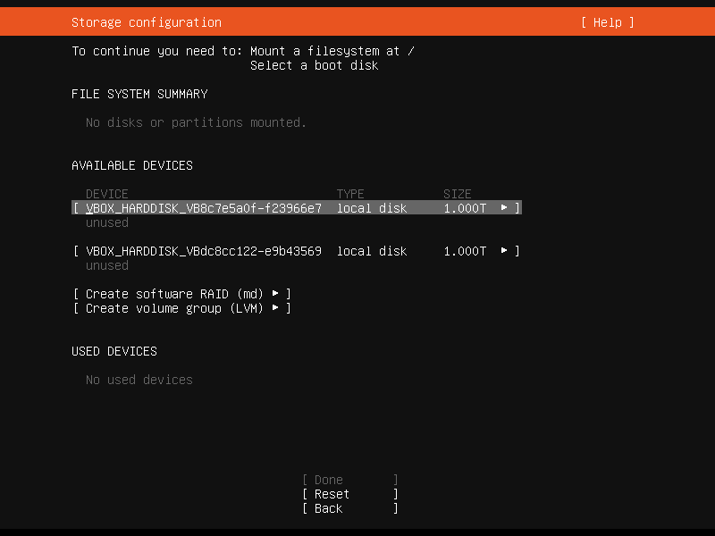

-   如果選錯了、或是硬碟中有已經分割好的磁區也沒關係，從 AVAILABLE DEVICES 下面選擇硬碟 ➜ 「Reformat」 ➜ 「Reformat」，這會把硬碟格式化。

<!-- -->

-   選擇第一個磁碟 ➜ 「Use As Boot Device」 當作開機磁碟

    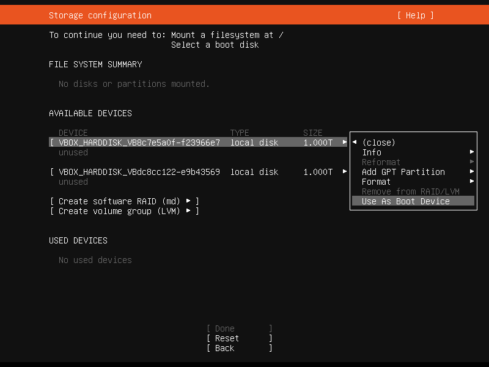

-   對第二個磁碟「VBOX_HARDDISK_VBdc8cc122-e9b43569」也做同樣的事情。

::: {.infobox .caution}
目前版本 20.04.2 live server 有個 bug，當你要新增為開機硬碟 (Boot Device) 時，要在建立其他三個分區 (`/` 、 `/boot` 和 `[SWAP]`)之前，先設定好，不然 1Mb 的 grub 分區會消失。(我只有從現過錯誤一次 2021.07.21)
:::

-   接著為 `/` 、 `/boot` 和 `[SWAP]` 做分區。

    -   `/`: 系統根目錄磁區

    -   `/boot`: 開機磁區

    -   `[SWAP]`: [SWAP](http://linux.vbird.org/linux_basic/0230filesystem.php#swap) (記憶體置換空間) 主要功能是當記憶體滿載時，會把現在沒有用到的程序先放到 SWAP 中，空給目前正在運行的程式使用

-   首先為 `/boot` 分區，通常開機磁區 512 Mb \~ 1Gb 就很夠用了，看你喜好，這裡我選擇 1Gb。選擇第一個磁碟 ➜ 「Add GPT Partitation」，照下面的設定設定後，按「Create」。

    -   Size: `1G`

    -   Format: `[ Leave unformatted ▾ ]`

-   對第二顆硬碟做同樣的事。

    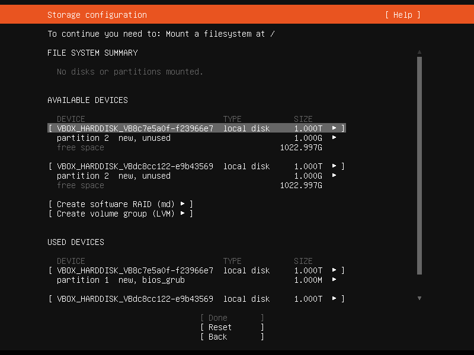

-   再來是 `[SWAP]` 磁區，一般來說會用實體記憶體容量 ⨉ 2 作為 `[SWAP]` 磁區的容量，這裡我怕空間太少先用 32Gb。選擇第一個磁碟 ➜ 「Add GPT Partitation」，照下面的設定設定後，按「Create」。

    -   Size: `32G`

    -   Format: `[ Leave unformatted ▾ ]`

-   對第二顆硬碟做同樣的事。

    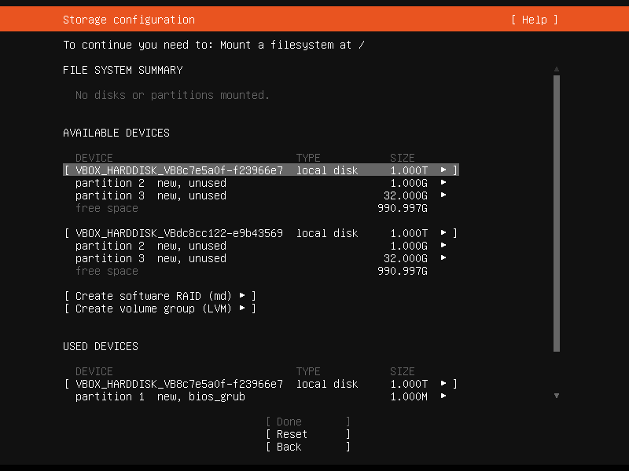

-   最後才是系統硬碟 `/` ，系統硬碟使用 `/boot` 、`[SWAP]` 與 `grub` 剩下來的空間。選擇第一個磁碟 ➜ 「Add GPT Partitation」，照下面的設定設定後，按「Create」。

    -   Size: `留空` 預設為剩下硬碟的容量，正是我們所要的

    -   Format: `[ Leave unformatted ▾ ]`

-   對第二顆硬碟做同樣的事。

    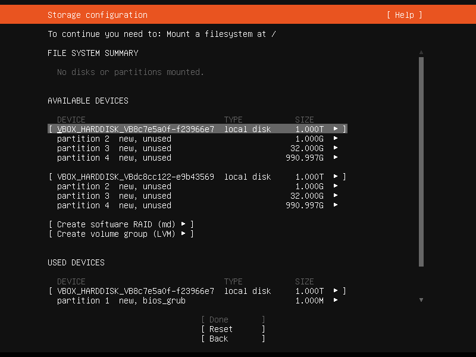

-   接著設定 Raid-1。選取「[ Create software RAID (md) ▸ ]」，選取兩個「partition 2」建立 `md0` softRaid 磁區

    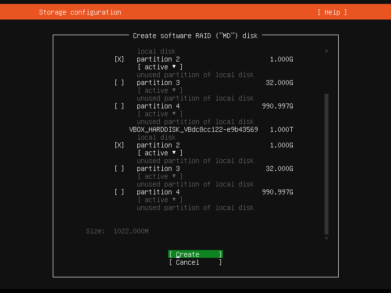

-   同上，選取「[ Create software RAID (md) ▸ ]」，選取兩個「partition 3」建立 `md1` softRaid 磁區

-   同上，選取「[ Create software RAID (md) ▸ ]」，選取兩個「partition 4」建立 `md2` softRaid 磁區

    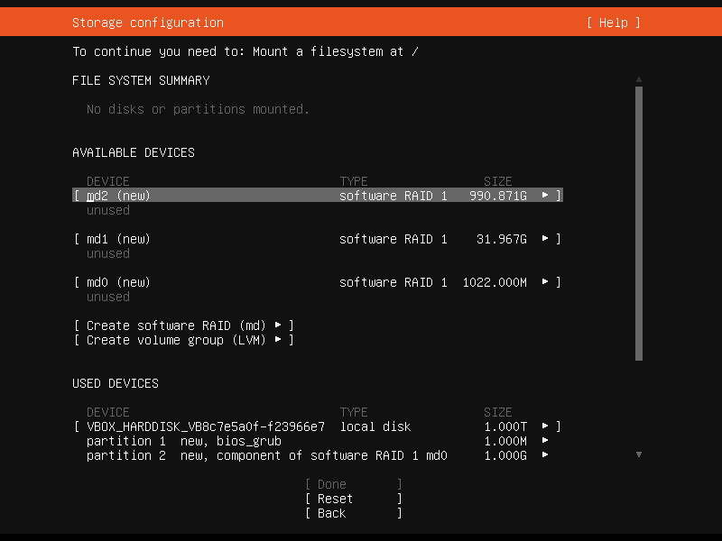

-   選擇 `md0 (new)` ➜ format ➜ Format: 選擇 `ext4` 格式 ➜ Mount: 掛載於 `/boot` ➜ 完成後選擇 Done

-   選擇 `md1 (new)` ➜ format ➜ Format: 選擇 `swap` 格式 ➜ 完成後選擇 Done

-   選擇 `md2 (new)` ➜ format ➜ Format: 選擇 `ext4` 格式 ➜ Mount: 掛載於 `/` ➜ 完成後選擇 Done

-   設定完成🎉，整體設定截圖:

    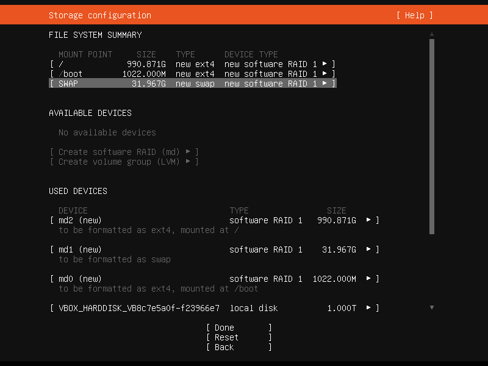

    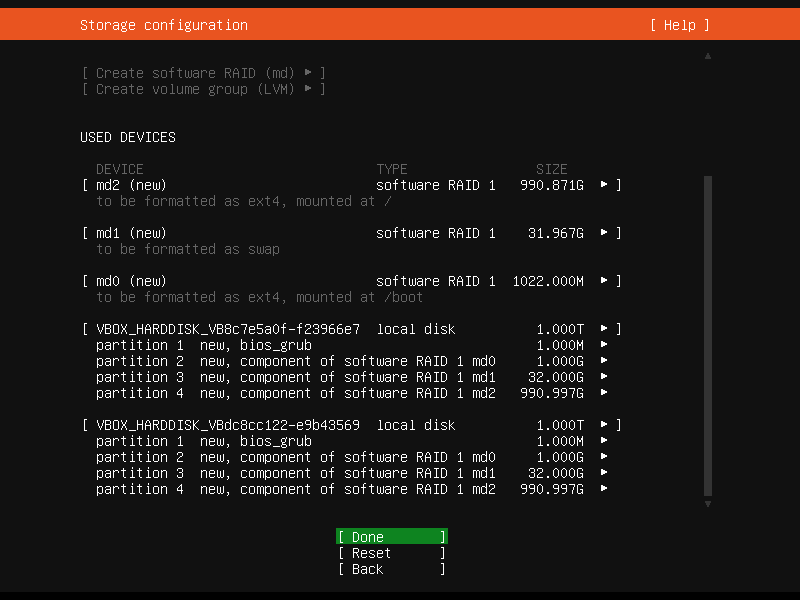

-   在最下面選擇「Done」，跳至下一步

#### 使用者設定

這邊我是用院伺服器預設的 hostname 與 使用者設定。

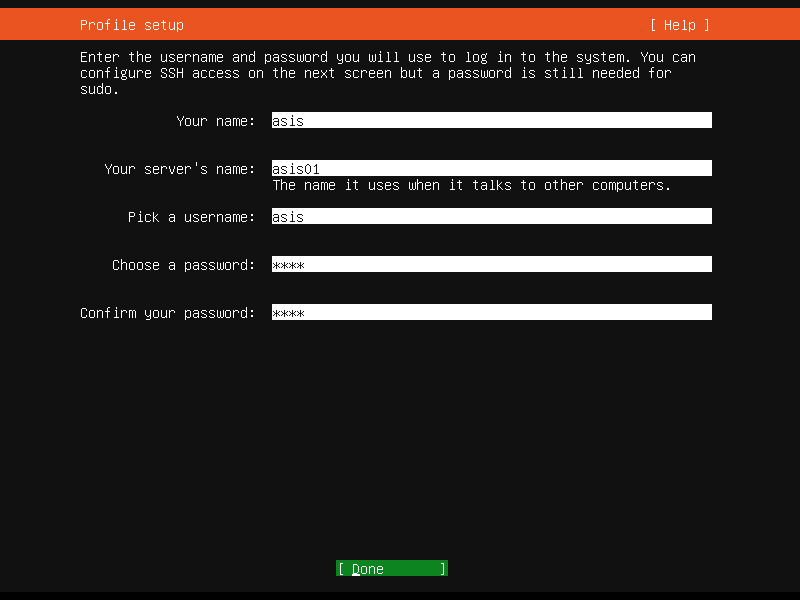

-   Your name: `fintech`

-   Your server's name: `fintech06`

-   Pick a username: `fintech`

-   Choose a password: `fintech`

-   Confirm your password: `fintech`

#### OpenSSH 設定

OpenSSH 是使用 SSH 通訊協定來遠端連線電腦的工具。防止連線中被竊聽、劫持或是其他攻擊。詳細設定可以參考 DigitalOcean 中的[教學](https://docs.digitalocean.com/products/droplets/how-to/add-ssh-keys/)。

##### 從 Github 匯入已經儲存的 public key

這裡將 Allow password authentication over SSH 取消打勾，經由 SSH 連線至虛擬主機時，關閉使用者密碼認證，改由 SSH key pairs 登入。

::: {.infobox .info}
如果沒有持有 Github 帳號儲存的 public key，請把 Allow password authentication over SSH 打勾，待上傳完 public key 再把使用密碼登入關閉。
:::

另外，我已經透過 Github 儲存過我的 public key 副本，所以這邊可以直接從 Github 匯入 public key。

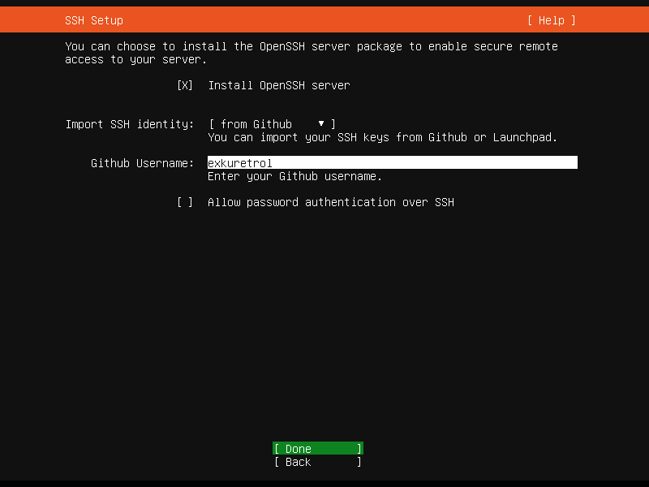

::: {.infobox .info}
如果這邊不匯入的話，也可以待稍後開機後再用指令 `gh-import-id-gh <username>` 匯入。
:::

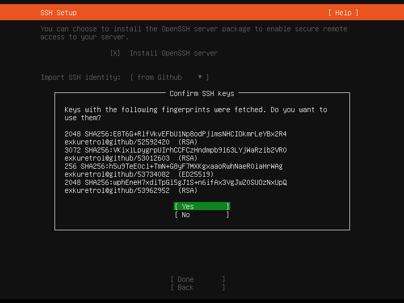

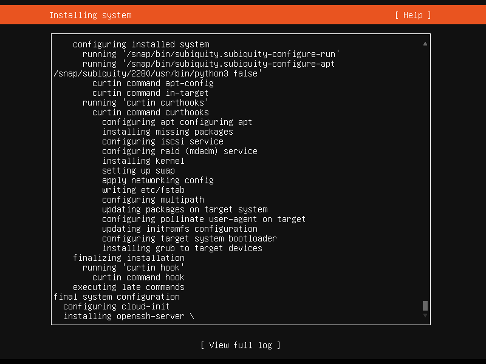

匯入成功後就能經由含有 Github 副本的 SSH key pairs 主機連線至虛擬機器

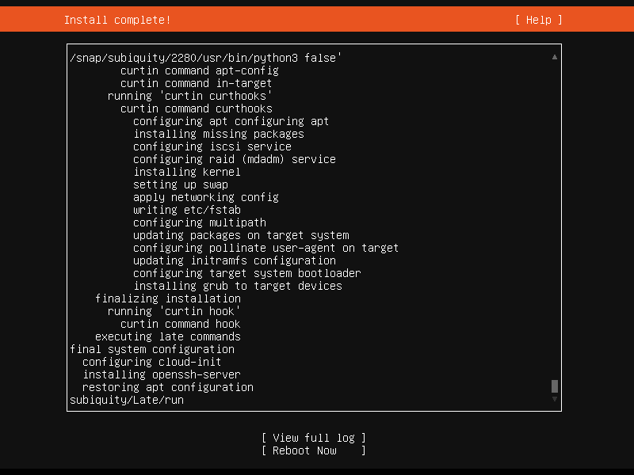

安裝完成後重新啟動
