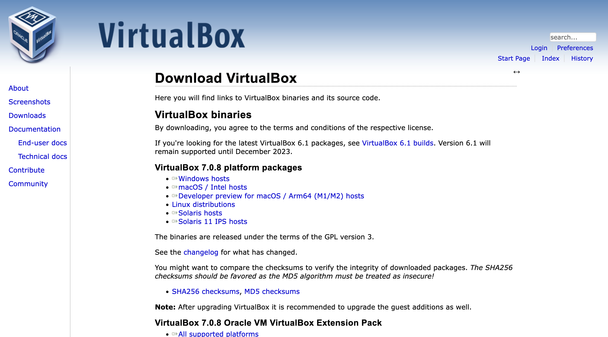

# 事前準備 {#intro}

## 引言

應用於實體電腦之前，我們會在虛擬機器內先執行過一遍，確認操作沒問題後，才會在實體點腦上操作。這裡我選用 VirtualBox 作為示範。

## 安裝 VirtualBox

先到 [VirtualBox 官方網站](https://www.virtualbox.org/wiki/Downloads)的下載頁面，下載適合你電腦系統的安裝執行檔，假如是 Windows 系統就點擊 「Windows hosts」的下載連結，如果是其他作業系統就根據你的作業系統下載對應的檔案。

{.figure}

安裝的過程中只需使用預設的設定即可，預設設定做了安裝虛擬機器的驅動程式、關聯檔案...等等，正常安裝不需要變更它。

{.figure}

## 於虛擬機器安裝作業系統

再安裝完 VirtualBox 後，打開並不會有預先安裝好的作業系統，需要在 VirtualBox 內自行安裝作業系統。首先介紹 VirtualBox 的使用者介面:

```{r virtualbox-menu, fig.align='center', fig.cap='VirtualBox 的操作介面', echo=FALSE}
knitr::include_graphics("./figures/virtualbox-menu.png", dpi = NA)
```

如 \@ref(fig:virtualbox-menu) 所示，右邊主要功能圖示由左而右的功能分別是:

1.  **喜好設定:** 設定 VirtualBox 的整體設定，像是軟體語言、虛擬機器預設存放位置...等等
2.  **匯入:** 匯入虛擬機器檔案 (.ovf)
3.  **匯出:** 匯出虛擬機器檔案
4.  **新增:** 新增*新的*虛擬主機
5.  **加入:** 加入*已經存在*的虛擬主機

### 新增 Ubuntu 作業系統設定

所以要新增新的虛擬機器是按「新增」。

{.figure}

這裡先點選「專家模式」，專家模式可以一併設定虛擬機器的所有設定。

{.figure}

記憶體大小根據每個人電腦的性能做調整，虛擬主機沒用來做什麼事最多4Gb (4 \* 1024Mb) 就很夠用了。這裡要注意的一點是，虛擬機器的存放位置，當你要轉移虛擬機器時才不會找不到。

預設的虛擬機器存放位置位於使用者資料夾中的`Virtual VMs`資料夾，像我的使用者是qaz85，那虛擬機器就位於:

    C:\Users\qaz85\VirtualBox VMs

類型與版本記得設定為 Linux 與 Ubuntu 64位元 版本。完成之後點擊「建立」。

{.figure}

這裡我會選 VMDK 格式的原因是因為，如果要轉移虛擬主機檔案時，單一個檔案會輕易地超過 4Gb，而超過此上限得檔案在複製時，如果目的地的裝置格式不是 ntfs 的話，會沒有辦法複製。為了預防這個問題，我在這邊先選擇 VMDK 作為我虛擬主機的檔案格式。

這裡如果選擇「固定大小」會新增一個跟你設定的檔案大小一樣大的虛擬機器檔案，除非你的硬碟很大，否則不建議這麼做。

<!--# TODO: 這邊可以再加如果虛擬主機已經是 VDI 格式怎麼轉換成 VMDK 格式的教學 -->

{.figure}

完成後，會在 Virtual Machine 的選單左邊看見剛剛新建的虛擬機器，不過此時的虛擬機器內還沒有作業系統。

### 於 VirtualBox 安裝作業系統
