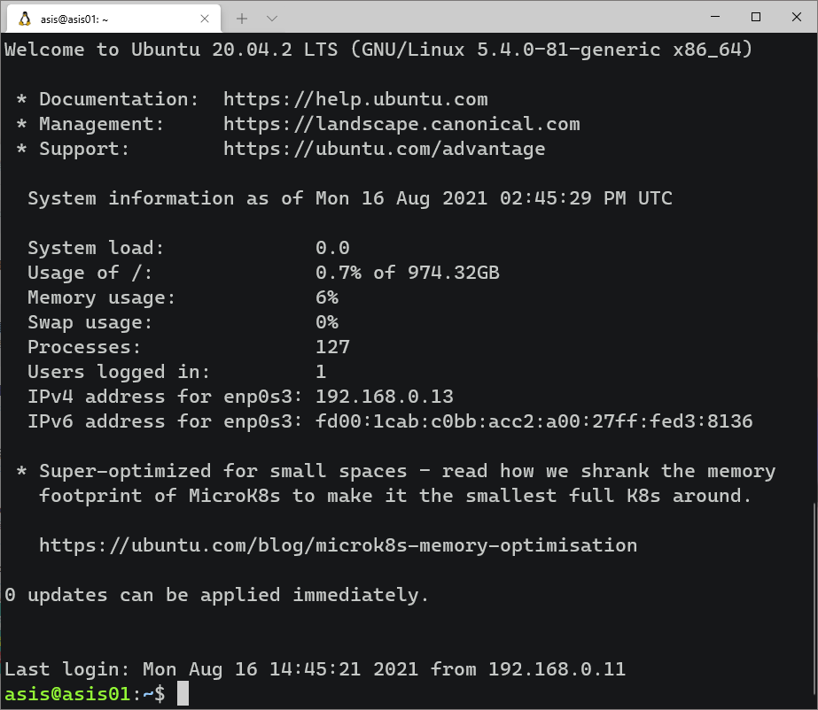

# Ubuntu 的基本設定

<!--# TODO: https://superuser.com/questions/1200355/wsl-is-it-possible-to-access-and-manipulate-a-virtual-linux-machine-with-wsl -->

這章主重心主要會在從本機存取虛擬機器與虛擬機器的基本設定。

## 事前準備

<!--# TODO: appendix -- install Windows Terminal -->

## OpenSSH

前面第一章在安裝時，也有碰到 OpenSSH 伺服器設定的環節，不過那並不完整，是給已經擁有透過 `ssh-keygen` 產生的 ssh key pairs 的人看的。在這個小節會逐步解釋，從 OpenSSH client 安裝、產生 ssh key pairs 最後到連線。

### 適合各個系統的連線流程

要連接到虛擬機器的 OpenSSH 伺服器之前，你需要有一個可以讓你連接的 OpenSSH 客戶端。

#### MacOS 或 其他 Unix-like 系統

如果你是 Linux 或是 MacOS 系統，通常都有內建 OpenSSH 客戶端，可以直接跳至 [以 OpenSSH Client 產生 key](#以-openssh-client-產生-key) 的環節，Windows 與 Linux 使用 OpenSSH Utility 產生 ssh key pairs 的流程是一樣的。

#### Windows 系統

而 Windows 用戶不用擔心，Windows 用戶連線至 OpenSSH 伺服器的方法有很多種，就我已知的方法如下:

1.  已經擁有 SSH key pairs 的前提下，可以使用 SSH 通訊協定連線的軟體，如:

    -   PuTTY

    -   Termius

    -   Chrome 瀏覽器的任何一個 SSH 擴充套件\

    **pros:**

    -   很快；安裝完就能設定 SSH 連線

2.  直接在 Windows 10 內啟動 OpenSSH 用戶端，透過內建的 PowerShell SSH 連線至虛擬主機。\
    \
    **pros:**

    -   跟第一個方法差不多快，可搭配 Windows Terminal 客製化終端機主題

3.  在 Windows 10 內安裝 Windows 子系統 (Windows Subsystem for Linux; WSL)，然後直接在 Linux 環境透過 OpenSSH 連線至虛擬主機。\
    \
    **pros:**

    -   可以學習到很多東西， Linux 可以用的在 Windows 的 WSL 內都可以使用，操作可以照搬到 WSL 上面。目前我是使用這個方式連線。

    **cons:**

    -   安裝過程所需的時間會根據每個人的經驗有所差異，需要從頭開始設定 Linux。

在 Windows 要產生 ssh key pairs 有兩種辦法，第一種是經由內建的 OpenSSH Client 產生，另一種是經由 PuTTY 所附的工具產生 (可以參考附錄的[使用 PuTTY 連線至 OpenSSH 伺服器])。

::: {.infobox .info}
Linux 的使用者可以使用套件管理程式安裝 `openssh-server`。
:::

### Step 1 --- 安裝 OpenSSH Client {.unnumbered}

Windows 10 已經有內建在 Windows 的「應用程式與功能」內，預設是沒有安裝的。啟動流程如下:

-   點擊「開始」

-   打開「設定⚙」

-   選取「應用程式」 ➜ 「應用程式與功能」 ➜ 找到黑體字「程式與功能」，並點選下面的「選用功能」

-   在已安裝的篩選列上面篩選 `ssh` ，如果沒有，請在頁面頂端點選「新增功能」，然後:

    -   找到「OpenSSH 用戶端」後，點選安裝

安裝完成後，你可以打開「命令提示字元」或是「PowerShell」輸入 ssh 來確認是否安裝完成。

``` {.powershell}
PS C:\Users\qaz85> ssh
usage: ssh [-46AaCfGgKkMNnqsTtVvXxYy] [-B bind_interface]
           [-b bind_address] [-c cipher_spec] [-D [bind_address:]port]
           [-E log_file] [-e escape_char] [-F configfile] [-I pkcs11]
           [-i identity_file] [-J [user@]host[:port]] [-L address]
           [-l login_name] [-m mac_spec] [-O ctl_cmd] [-o option] [-p port]
           [-Q query_option] [-R address] [-S ctl_path] [-W host:port]
           [-w local_tun[:remote_tun]] destination [command]
```

### Step 2 --- 產生 ssh key pairs {.unnumbered}

接著，可以使用 `ssh-keygen` 指令產生 key pairs，加密方式有 rsa、dsa、ed25519 與 ecdsa ，預設的加密方式是 rsa ，詳細指令用法可以透過 `ssh-keygen --help` 指令查詢，這裡我們用最簡單的 `ssh-keygen` 指令就行。

``` {.powershell}
ssh-keygen
```

Windows 的用戶預設會把 key pair 儲存在 `C:\Users\<USERNAME>\.ssh\` 的位置，而 Linux 的用戶會儲存在 `~/.ssh/` 的位置。

``` {.powershell}
Generating public/private rsa key pair.
Enter file in which to save the key (C:\Users\<USERNAME>/.ssh/id_rsa):
```

這裡是詢問你要不要把產生的 ssh key 重新命名，一般不會動到它的名字，按 Enter↩，接續下一步。

``` {.powershell}
Created directory 'C:\Users\<USERNAME>/.ssh'.
Enter passphrase (empty for no passphrase):
Enter same passphrase again:
```

一旦你設定了 key pairs 的密碼，你每次連線時，都要再輸入一次密碼才能連線。如果不想那麼麻煩的話，可以按 Enter↩ 保持留空。

``` {.powershell}
Your identification has been saved in C:\Users\<USERNAME>/.ssh/id_rsa.
Your public key has been saved in C:\Users\<USERNAME>/.ssh/id_rsa.pub.
The key fingerprint is:
SHA256:8NE76AD294Tjze76pEPtvZgqaqw9OuCF7T8HWPo6fUc qaz85@DESKTOP-OH6HA84
The key's randomart image is:
+---[RSA 3072]----+
|                 |
|         .       |
|    o . . .      |
|   . + o + .     |
|  o + o S.+      |
|.. = . =.E..     |
|..o.o ..+.=.     |
| ..+++.o.=.o.    |
|  o**++.=** ..   |
+----[SHA256]-----+
```

產生完畢，儲存在 `C:\Users\<USERNAME>\.ssh\id_rsa` 的檔案是 private key，而另一個 `id_rsa.pub` 的檔案是 public key。

<!--# TODO: 我覺得應該把 PuTTY 的部分獨立出來 -->

::: {.infobox .caution}
當你遺失了遠端主機的 key pairs，你再也不能透過遠端存取有使用過該 key pairs 的主機，只能透過直接接觸那台主機來更新的 key pairs。
:::

### Step 3 --- 將新增的 key pairs 上傳至目的地主機 {.unnumbered}

當你擁有了 [前一步產生的 key pairs](#step-2-產生-ssh-key-pairs)，接下來要把 public key 上傳至虛擬機器。另外 public key 給別人看到是沒問題的，前面第一章的 [OpenSSH設定](#從-github-匯入已經儲存的-public-key) 就已經有出現過我的 public key 了，public key 並不能用來產生 private key，它是用來認證這個 key 是否跟你所持有的 private key 相呼應。

如果你是的系統是 Linux 那指令會稍微短一些，上傳至遠端電腦的指令如下:

``` {.bash}
ssh-copy-id -i ~/.ssh/id_ed25519.pub -p 22 fintech@192.168.0.13
```

-   `-i`: i flag 代表的是你要上傳的 public key 檔案路徑

-   `-p`: p flag 則是目的地主機的 OpenSSH 伺服器的埠號

-   `id_ed25519.pub` 為我產生的其他的 key pair，如果你前面是照著我的步驟產生，這裡應該改為 `id_rsa.pub`

-   這裡的 `fintech` 為第一章的[使用者設定](#使用者設定)的預設使用者

-   `192.168.0.13` 為我虛擬主機的 ip 位址，查詢 ip 位址可以先手動登入虛擬主機後，用 `hostname -I` 或是 `ip addr show` 指令查詢

完成後會提示你已經可以使用 ssh 連線

``` {.bash}
/usr/bin/ssh-copy-id: INFO: Source of key(s) to be installed: "/home/kuaz/.ssh/id_ed25519.pub"
/usr/bin/ssh-copy-id: INFO: attempting to log in with the new key(s), to filter out any that are already installed
/usr/bin/ssh-copy-id: INFO: 1 key(s) remain to be installed -- if you are prompted now it is to install the new keys

Number of key(s) added: 1

Now try logging into the machine, with:   "ssh -p '22' 'fintech@192.168.0.13'"
and check to make sure that only the key(s) you wanted were added.
```

如果你是 Windows 的使用者也不用擔心多複雜，一樣一行指令就能搞定，這裡我是參考[@christopher_2020]的教學，指令如下:

``` {.powershell}
cat $env:USERPROFILE\.ssh\id_rsa.pub | ssh fintech@192.168.0.13 "cat >> ~/.ssh/authorized_keys"
```

-   這裡的 `$env:USERPROFILE` 為 Windows 內建環境變數，會根據現在的使用者變更，如果我的使用者名稱為 `qaz855175b` 那 `$env:USERPROFILE` 對應的路徑就為 `C:\Users\qaz855175b\`，當然你可以直接把指令的 public key 路徑替換為 `C:\Users\qaz855175b\.ssh\id_rsa.pub`

-   `id_rsa.pub` 為產生的 public key 預設名稱

-   這裡的 `fintech` 為第一章的[使用者設定](#使用者設定)的預設使用者

-   `192.168.0.13` 為我虛擬主機的 ip 位址，查詢 ip 位址可以先手動登入虛擬主機後，用 `hostname -I` 或是 `ip addr show` 指令查詢

::: {.infobox .info}
其實 Linux 的 `ssh-copy-id`、和第一章的從 Github 匯入 public key `ssh-import-id-gh` 與這裡的 `cat file >> ~/.ssh/authorized_keys` 都是在做同一件事情，把 public key 貼到遠端伺服器的使用者的 `authorized_keys` 檔案裡面。
:::

接著按 Enter↩，跳出輸入密碼提示，這裡輸入預設的使用者密碼 `fintech`

``` {.powershell}
fintech@192.168.0.13's password:
```

輸入完後雖然沒有任何提示訊息，但其實已經可以使用 ssh 連線至遠端主機啦\~

### Step 4 --- 測試 SSH 連線，使用 SSH 連線至遠端主機 {.unnumbered}

最後，使用 ssh 指令連接至遠端主機。

使用 OpenSSH Client 產生的 pair keys 可以直接使用這個方法連線。這裡介紹幾個常常與 ssh 一起出現的 flag :

-   `-v`: verbose; 顯示連接時更詳細的訊息，debug時常用

-   `-p`: port; 遠端伺服器的埠號

-   `-i`: 手動指定 private key 位址

::: {.infobox .info}
flag 通常會在指令後面隨後出現，flag前面會插入 `-`，而 flag 後面有時會需要加入詳細的設定，有時不用。flag 與 flag 之間用空格隔開，詳細指令的使用方法可以在 Linux 系統用 `man <指令名稱>` 查詢

假如我們要看連線的詳細訊息，且指定伺服器 port 為 60000與指定 private key 檔案位址等等，組合起來就是:

``` {.bash}
ssh -v -p 60000 -i ~/.ssh/id_rsa fintech@192.168.0.13
```
:::

目前不需要加上任何 flag，連線指令為:

``` {.bash}
ssh fintech@192.168.0.13
```

一樣地，`fintech` 是使用者名稱，而`192.168.0.13` 是 OpenSSH 伺服器的 ip 位置，輸入完後按 Enter↩

這邊打 `yes` 即可，確認連接目的地沒有錯之後，會把 fingerprint 寫入 `~/.ssh/known_hosts` 中，以後不再詢問。

``` {.texinfo}
The authenticity of host '192.168.0.13 (192.168.0.13)' can't be established.
ECDSA key fingerprint is SHA256:/HoocrLXe63zycdlmkh/+U3RuUfkawNq/xA0gTJmqmM.
Are you sure you want to continue connecting (yes/no/[fingerprint])?
```

::: {.infobox .info}
這裡不用指定 private key 的原因是因為，當你用 ssh 連線至目的地伺服器且你沒有指定 Identity File (private key) 時，ssh 會一個 key 一個 key 拿去問伺服器這個 key 可不可以使用。
:::

連接成功\~

{.figure}

### Step 5 --- 使遠端的 OpenSSH 伺服器更加安全 {.unnumbered}

#### 變更 SSH 伺服器預設的埠號 {.unnumbered}

``` {.bash}
sudo vi /etc/ssh/sshd_config
```

將 `#Port 22` 取消註解，並把 `22` 改成其他介於 1-65535 之間的數字。

``` {.bash}
#       $OpenBSD: sshd_config,v 1.103 2018/04/09 20:41:22 tj Exp $

# This is the sshd server system-wide configuration file.  See 
# sshd_config(5) for more information.

# This sshd was compiled with PATH=/usr/bin:/bin:/usr/sbin:/sbin

# The strategy used for options in the default sshd_config shipped with
# OpenSSH is to specify options with their default value where
# possible, but leave them commented.  Uncommented options override the
# default value.

Include /etc/ssh/sshd_config.d/*.conf

Port 60000
#AddressFamily any
#ListenAddress 0.0.0.0
#ListenAddress ::
```

#### 關閉密碼驗證 {.unnumbered}

將 PasswordAuthentication (以密碼驗證) 設為 no。使用 SSH 連線時，如果沒有指定 SSH key pair，如果 OpenSSH 伺服器的設定沒有關閉，接著會要求你輸入使用者密碼以密碼驗證。通常這個設定會開啟是因為要[複製 ssh 的 public key](#step-3-將新增的-key-pairs-上傳至目的地主機)。

``` {.bash}
PasswordAuthentication no
```

當然如果密碼驗證為 no，且同時遺失 SSH 的 pair key 時，你就無法以 SSH 連線至遠端主機。

#### 關閉遠端 root 登入 {.unnumbered}

``` {.bash}
PermitRootLogin no
```

#### 限制能使用 SSH 連線的使用者 {.unnumbered}

``` {.bash}
AllowUsers fintech
```

#### 關閉無密碼的使用者使用 SSH {.unnumbered}

``` {.bash}
PermitEmptyPasswords no
```

#### 測試 `sshd_config` 是否有效 {.unnumbered}

``` {.bash}
sudo sshd -t
```

``` {.bash}
sudo systemctl restart sshd
```

## Apt

``` {.bash}
sudo apt update && sudo apt upgrade -y
```

## UFW

``` {.bash}
sudo ufw status
```

    Status: inactive

``` {.bash}
sudo ufw allow 60000
```

``` {.bash}
sudo ufw status
```

    Status: active

    To                         Action      From
    --                         ------      ----
    60000                      ALLOW       Anywhere
    60000 (v6)                 ALLOW       Anywhere (v6)

l
