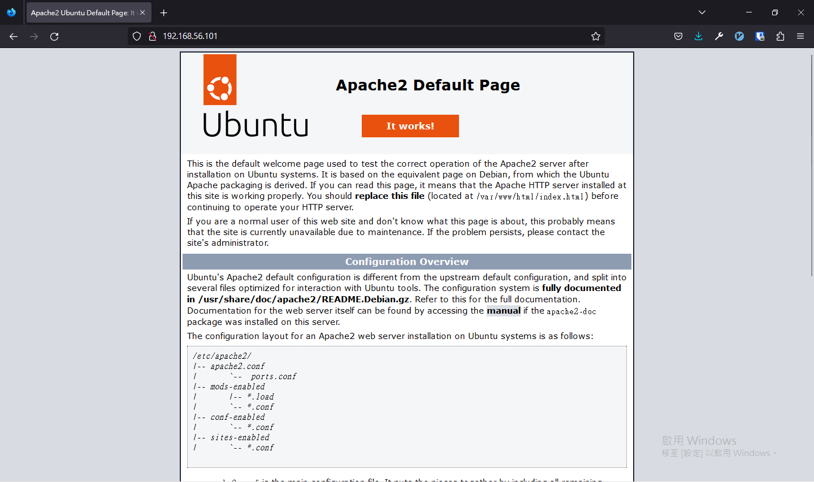
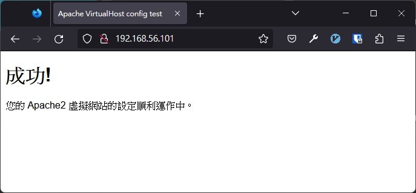

# LAMP

LAMP 是由 4 個單字開頭的字組成的詞。 LAMP 讓你可以在一台系統為 **L**inux 的電腦上，用 **A**pache 架設網站伺服器，其中儲存在 **M**ySQL 裡面，最後用 **P**HP 執行動態的網站。

這章會教你怎麼安裝 LAMP。

## 事前準備

在安裝軟體之前，你需要有一個可以執行 `sudo` 指令的使用者，如果你是照著教學做的話，這個使用者為安裝時的預設使用者 `asis`。

## Apache

### Step 1 --- 安裝 Apache

``` {.bash .prefixed}
sudo apt update
```

``` {.bash .prefixed}
sudo apt info apache2
```

``` {.console_output}
Package: apache2
Version: 2.4.41-4ubuntu3.4
Priority: optional
Section: web
Origin: Ubuntu
Maintainer: Ubuntu Developers <ubuntu-devel-discuss@lists.ubuntu.com>
Original-Maintainer: Debian Apache Maintainers <debian-apache@lists.debian.org>
Bugs: https://bugs.launchpad.net/ubuntu/+filebug
Installed-Size: 542 kB
Provides: httpd, httpd-cgi
Pre-Depends: dpkg (>= 1.17.14)
Depends: apache2-bin (= 2.4.41-4ubuntu3.4), apache2-data (= 2.4.41-4ubuntu3.4), apache2-utils (= 2.4.41-4ubuntu3.4), lsb-base, mime-support, perl:any, procps
Recommends: ssl-cert
Suggests: apache2-doc, apache2-suexec-pristine | apache2-suexec-custom, www-browser, ufw
Conflicts: apache2.2-bin, apache2.2-common
Breaks: libapache2-mod-proxy-uwsgi (<< 2.4.33)
Replaces: apache2.2-bin, apache2.2-common, libapache2-mod-proxy-uwsgi (<< 2.4.33)
Homepage: https://httpd.apache.org/
Task: lamp-server
Download-Size: 95.5 kB
APT-Sources: http://tw.archive.ubuntu.com/ubuntu focal-updates/main amd64 Packages
Description: Apache HTTP Server
 The Apache HTTP Server Project's goal is to build a secure, efficient and
 extensible HTTP server as standards-compliant open source software. The
 result has long been the number one web server on the Internet.
 .
 Installing this package results in a full installation, including the
 configuration files, init scripts and support scripts.
```

``` {.bash .prefixed}
sudo apt install apache2
```

``` {.console_output}
Reading package lists... Done
Building dependency tree       
Reading state information... Done
The following additional packages will be installed:
  apache2-bin apache2-data apache2-utils libapr1 libaprutil1 libaprutil1-dbd-sqlite3 libaprutil1-ldap
  libjansson4 liblua5.2-0 ssl-cert
Suggested packages:
  apache2-doc apache2-suexec-pristine | apache2-suexec-custom www-browser openssl-blacklist
The following NEW packages will be installed:
  apache2 apache2-bin apache2-data apache2-utils libapr1 libaprutil1 libaprutil1-dbd-sqlite3
  libaprutil1-ldap libjansson4 liblua5.2-0 ssl-cert
0 upgraded, 11 newly installed, 0 to remove and 0 not upgraded.
Need to get 1,865 kB of archives.
After this operation, 8,083 kB of additional disk space will be used.
Do you want to continue? [Y/n] 
```

``` {.bash .console_output}
sudo apt install apache2 --yes
```

### Step 2 --- 調整防火牆 ufw 設定

``` {.bash .prefixed}
sudo ufw app list
```

``` {.console_output}
Available applications:
  Apache
  Apache Full
  Apache Secure
  OpenSSH
```

-   **Apache**：會在防火牆新增一個埠號 `80` 的規則。

-   **Apache Full**：會在防火牆新增一個埠號 `80` 與埠號 `443` 的規則。

-   **Apache Secure**：在防火牆新增一個埠號 `443` 的規則。

``` {.bash .prefixed}
sudo ufw allow "Apache"
```

``` {.console_output}
Rule added
Rule added (v6)
```

``` {.bash .prefixed}
sudo ufw status
```

``` {.console_output}
Status: active

To                         Action      From
--                         ------      ----
60000                      ALLOW       Anywhere                  
Apache                     ALLOW       Anywhere                  
60000 (v6)                 ALLOW       Anywhere (v6)             
Apache (v6)                ALLOW       Anywhere (v6) 
```

    http://<虛擬主機的 ip 地址>/

``` {.bash .prefixed}
ip show addr
```

``` {.console_output}
1: lo: <LOOPBACK,UP,LOWER_UP> mtu 65536 qdisc noqueue state UNKNOWN group default qlen 1000
    link/loopback 00:00:00:00:00:00 brd 00:00:00:00:00:00
    inet 127.0.0.1/8 scope host lo
       valid_lft forever preferred_lft forever
    inet6 ::1/128 scope host 
       valid_lft forever preferred_lft forever
2: enp0s3: <BROADCAST,MULTICAST,UP,LOWER_UP> mtu 1500 qdisc fq_codel state UP group default qlen 1000
    link/ether 08:00:27:59:13:f9 brd ff:ff:ff:ff:ff:ff
    inet 192.168.0.14/24 brd 192.168.0.255 scope global dynamic enp0s3
       valid_lft 315329303sec preferred_lft 315329303sec
    inet6 fd00:1cab:c0bb:acc2:a00:27ff:fe59:13f9/64 scope global dynamic mngtmpaddr noprefixroute 
       valid_lft 535427sec preferred_lft 401570sec
    inet6 fe80::a00:27ff:fe59:13f9/64 scope link 
       valid_lft forever preferred_lft forever
```

``` {.bash .prefixed}
hostname-I
```

``` {.console_output}
192.168.0.14 fd00:1cab:c0bb:acc2:a00:27ff:fe59:13f9
```



## MySQL

``` {.bash .prefixed}
sudo apt install mysql-server -y
```

<!--# https://dev.mysql.com/doc/refman/8.0/en/mysql-secure-installation.html -->

``` {.bash .orefixed}
sudo mysql_secure_installation
```

``` {.console_output}
Securing the MySQL server deployment.

Connecting to MySQL using a blank password.

VALIDATE PASSWORD COMPONENT can be used to test passwords
and improve security. It checks the strength of password
and allows the users to set only those passwords which are
secure enough. Would you like to setup VALIDATE PASSWORD component?

Press y|Y for Yes, any other key for No: 
```

``` {.console_output}
Securing the MySQL server deployment.

Connecting to MySQL using a blank password.
The 'validate_password' component is installed on the server.
The subsequent steps will run with the existing configuration
of the component.
Please set the password for root here.

New password: 
```

``` {.console_output}
Re-enter new password: 

Estimated strength of the password: 100 
Do you wish to continue with the password provided?(Press y|Y for Yes, any other key for No) : Y
```

``` {.console_output}
By default, a MySQL installation has an anonymous user,
allowing anyone to log into MySQL without having to have
a user account created for them. This is intended only for
testing, and to make the installation go a bit smoother.
You should remove them before moving into a production
environment.

Remove anonymous users? (Press y|Y for Yes, any other key for No) : Y
```

``` {.console_output}
Normally, root should only be allowed to connect from
'localhost'. This ensures that someone cannot guess at
the root password from the network.

Disallow root login remotely? (Press y|Y for Yes, any other key for No) : Y
```

``` {.console_output}
 - Dropping test database...
Success.

 - Removing privileges on test database...
Success.

Reloading the privilege tables will ensure that all changes
made so far will take effect immediately.

Reload privilege tables now? (Press y|Y for Yes, any other key for No) : Y
Success.

All done! 
```

``` {.bash .prefixed}
sudo mysql
```

``` {.sqlmysql .mysql}
show variables like 'validate_password%';
```

``` {.sqlmysql}
alter user 'root'@'localhost' identified with caching_sha2_password by '<你的密碼>';
```

``` {.sqlmysql}
flush privileges;
```

## PHP

### Step 1 --- 安裝 php & php-mysql

``` {.bash .prefixed}
sudo apt update
```

``` {.bash .prefixed}
sudo apt info php
```

``` {.console_output}
Package: php
Version: 2:7.4+75
Priority: optional
Section: php
Source: php-defaults (75)
Origin: Ubuntu
Maintainer: Ubuntu Developers <ubuntu-devel-discuss@lists.ubuntu.com>
Original-Maintainer: Debian PHP Maintainers <team+pkg-php@tracker.debian.org>
Bugs: https://bugs.launchpad.net/ubuntu/+filebug
Installed-Size: 13.3 kB
Depends: php7.4
Download-Size: 2,712 B
APT-Sources: http://tw.archive.ubuntu.com/ubuntu focal/main amd64 Packages
Description: server-side, HTML-embedded scripting language (default)
 PHP (recursive acronym for PHP: Hypertext Preprocessor) is a widely-used
 open source general-purpose scripting language that is especially suited
 for web development and can be embedded into HTML.
 .
 This package is a dependency package, which depends on latest stable
 PHP version (currently 7.4).
```

``` {.bash .prefixed}
sudo apt info php7.4
```

``` {.console_output}
Package: php7.4
Version: 7.4.3-4ubuntu2.5
Priority: optional
Section: php
Origin: Ubuntu
Maintainer: Ubuntu Developers <ubuntu-devel-discuss@lists.ubuntu.com>
Original-Maintainer: Debian PHP Maintainers <team+pkg-php@tracker.debian.org>
Bugs: https://bugs.launchpad.net/ubuntu/+filebug
Installed-Size: 73.7 kB
Provides: php
Depends: libapache2-mod-php7.4 | php7.4-fpm | php7.4-cgi, php7.4-common
Homepage: http://www.php.net/
Download-Size: 9,244 B
APT-Sources: http://tw.archive.ubuntu.com/ubuntu focal-updates/main amd64 Packages
Description: server-side, HTML-embedded scripting language (metapackage)
 This package is a metapackage that, when installed, guarantees that you
 have at least one of the four server-side versions of the PHP interpreter
 installed. Removing this package won't remove PHP from your system, however
 it may remove other packages that depend on this one.
 .
 PHP (recursive acronym for PHP: Hypertext Preprocessor) is a widely-used
 open source general-purpose scripting language that is especially suited
 for web development and can be embedded into HTML.
```

``` {.console_output}
sudo apt info php-mysql
```

``` {.console_output}
Package: php-mysql
Version: 2:7.4+75
Priority: optional
Section: php
Source: php-defaults (75)
Origin: Ubuntu
Maintainer: Ubuntu Developers <ubuntu-devel-discuss@lists.ubuntu.com>
Original-Maintainer: Debian PHP Maintainers <team+pkg-php@tracker.debian.org>
Bugs: https://bugs.launchpad.net/ubuntu/+filebug
Installed-Size: 13.3 kB
Depends: php-common, php7.4-mysql
Task: lamp-server
Download-Size: 2,000 B
APT-Sources: http://tw.archive.ubuntu.com/ubuntu focal/main amd64 Packages
Description: MySQL module for PHP [default]
 This package provides a MySQL module for PHP.
 .
 PHP (recursive acronym for PHP: Hypertext Preprocessor) is a widely-used
 open source general-purpose scripting language that is especially suited
 for web development and can be embedded into HTML.
 .
 This package is a dependency package, which depends on Debian's default
 PHP version (currently 7.4).
```

``` {.bash .prefixed}
sudo apt install php php-mysql --yes
```

``` {.bash .prefixed}
which php
```

``` {.console_output}
/usr/bin/php
```

``` {.bash .bash}
php --version
```

``` {.console_output}
PHP 7.4.3 (cli) (built: Jul  5 2021 15:13:35) ( NTS )
Copyright (c) The PHP Group
Zend Engine v3.4.0, Copyright (c) Zend Technologies
    with Zend OPcache v7.4.3, Copyright (c), by Zend Technologies
```

### Step 2 --- 建立虛擬網站（VirtualHost）（可選）

``` {.bash .prefixed}
sudo vim /etc/apache2/sites-available/test.conf
```

    <VirtualHost *:80>
        ServerAdmin webmaster@localhost
        DocumentRoot /var/www/test
        ErrorLog ${APACHE_LOG_DIR}/error.log
        CustomLog ${APACHE_LOG_DIR}/access.log combined
    </VirtualHost>

``` {.bash .prefixed}
ls -al /var/www/
```

``` {.console_output}
total 12
drwxr-xr-x  3 root root 4096 Sep  1 06:51 ./
drwxr-xr-x 14 root root 4096 Sep  1 06:51 ../
drwxr-xr-x  2 root root 4096 Sep  1 06:51 html/
```

``` {.bash .prefixed}
sudo mkdir /var/www/test
```

``` {.bash .prefixed}
sudo vim /var/www/test/index.html
```

``` {.html}
<!DOCTYPE html>
<html lang="zh-TW">
<head>
  <meta charset="UTF-8">
  <meta http-equiv="X-UA-Compatible" content="IE=edge">
  <meta name="viewport" content="width=device-width, initial-scale=1.0">
  <title>Apache VirtualHost config test</title>
</head>
<body>
  <h1>成功!</h1>
  <p>您的 Apache2 虛擬網站的設定順利運作中。</p>
</body>
</html>
```

``` {.bash .prefixed}
sudo a2dissite 000-default.conf
```

``` {.console_output}
Site 000-default disabled.
To activate the new configuration, you need to run:
  systemctl reload apache2
```

``` {.bash .prefixed}
sudo a2ensite test.conf
```

``` {.bash .prefixed}
sudo systemctl reload apache2
```

    http://<虛擬主機的 ip 地址>/



## phpMyAdmin
