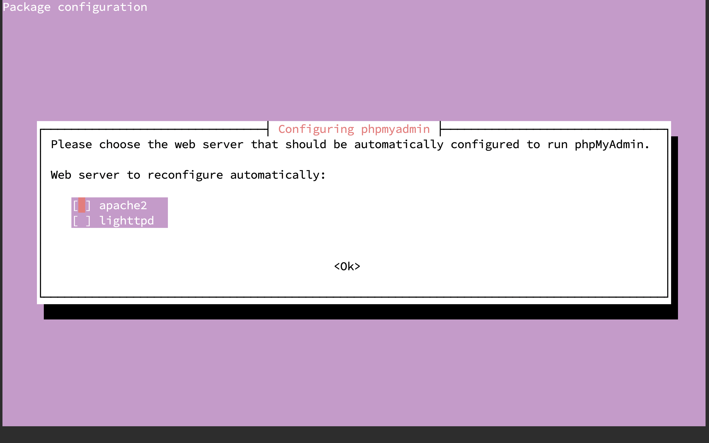
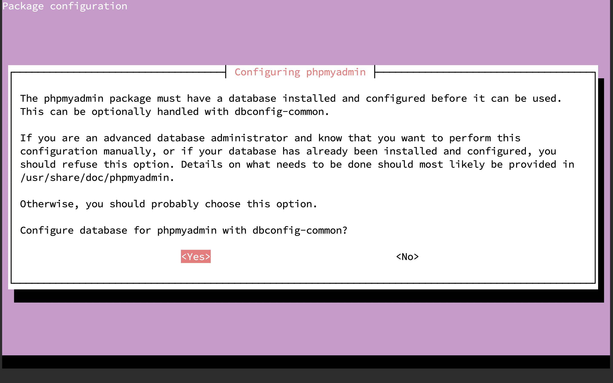
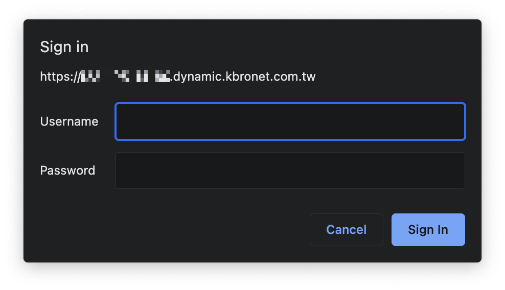

# LAMP

LAMP 是由 4 個單字開頭的字組成的詞。 LAMP 讓你可以在一台系統為 **L**inux 的電腦上，用 **A**pache 架設網站伺服器，其中儲存在 **M**ySQL 裡面，最後用 **P**HP 執行動態的網站。

這章會教你怎麼安裝 LAMP 程式集。

## 事前準備

在安裝軟體之前，你需要有一個可以執行 `sudo` 指令的使用者。 如果你是照著先前的教學做的話，這個使用者為安裝時的預設使用者 `asis`。

## Apache

### Step 1 --- 安裝 Apache

從來源更新套件資料：

``` {.bash .prefixed}
sudo apt update
```

確認是否是我們要安裝的 Apache2

``` {.bash .prefixed}
sudo apt info apache2
```

``` {.console_output}
Package: apache2
Version: 2.4.41-4ubuntu3.4
Priority: optional
Section: web
Origin: Ubuntu
Maintainer: Ubuntu Developers <ubuntu-devel-discuss@lists.ubuntu.com>
Original-Maintainer: Debian Apache Maintainers <debian-apache@lists.debian.org>
Bugs: https://bugs.launchpad.net/ubuntu/+filebug
Installed-Size: 542 kB
Provides: httpd, httpd-cgi
Pre-Depends: dpkg (>= 1.17.14)
Depends: apache2-bin (= 2.4.41-4ubuntu3.4), apache2-data (= 2.4.41-4ubuntu3.4), apache2-utils (= 2.4.41-4ubuntu3.4), lsb-base, mime-support, perl:any, procps
Recommends: ssl-cert
Suggests: apache2-doc, apache2-suexec-pristine | apache2-suexec-custom, www-browser, ufw
Conflicts: apache2.2-bin, apache2.2-common
Breaks: libapache2-mod-proxy-uwsgi (<< 2.4.33)
Replaces: apache2.2-bin, apache2.2-common, libapache2-mod-proxy-uwsgi (<< 2.4.33)
Homepage: https://httpd.apache.org/
Task: lamp-server
Download-Size: 95.5 kB
APT-Sources: http://tw.archive.ubuntu.com/ubuntu focal-updates/main amd64 Packages
Description: Apache HTTP Server
 The Apache HTTP Server Project's goal is to build a secure, efficient and
 extensible HTTP server as standards-compliant open source software. The
 result has long been the number one web server on the Internet.
 .
 Installing this package results in a full installation, including the
 configuration files, init scripts and support scripts.
```

安裝 Apache2

``` {.bash .prefixed}
sudo apt install apache2
```

``` {.console_output}
Reading package lists... Done
Building dependency tree       
Reading state information... Done
The following additional packages will be installed:
  apache2-bin apache2-data apache2-utils libapr1 libaprutil1 libaprutil1-dbd-sqlite3 libaprutil1-ldap
  libjansson4 liblua5.2-0 ssl-cert
Suggested packages:
  apache2-doc apache2-suexec-pristine | apache2-suexec-custom www-browser openssl-blacklist
The following NEW packages will be installed:
  apache2 apache2-bin apache2-data apache2-utils libapr1 libaprutil1 libaprutil1-dbd-sqlite3
  libaprutil1-ldap libjansson4 liblua5.2-0 ssl-cert
0 upgraded, 11 newly installed, 0 to remove and 0 not upgraded.
Need to get 1,865 kB of archives.
After this operation, 8,083 kB of additional disk space will be used.
Do you want to continue? [Y/n] 
```

也可以在安裝時加上 `--yes` 略過確認安裝提示。

``` {.bash .console_output}
sudo apt install apache2 --yes
```

### Step 2 --- 調整防火牆 ufw 設定

有些程式會自動把設定檔加入 ufw 中，這樣就可以透過設定檔啟用/關閉設定防火牆允許的埠號，不用再特別記下該軟體的設定。 可以透過指令顯示有什麼可用的應用程式設定檔。

``` {.bash .prefixed}
sudo ufw app list
```

下列是目前可用的設定檔：

``` {.console_output}
Available applications:
  Apache
  Apache Full
  Apache Secure
  OpenSSH
```

-   **Apache**：會在防火牆新增一個允許從任何地方連線至埠號 `80` 的規則。

-   **Apache Full**：會在防火牆新增一個允許從任何地方連線至埠號 `80` 與埠號 `443` 的規則。

-   **Apache Secure**：在防火牆新增一個允許從任何地方連線至埠號 `443` 的規則。\

使用方式很簡單，跟允許埠號時的指令一樣，把埠號改成設定檔名稱即可。

``` {.bash .prefixed}
sudo ufw allow "Apache"
```

``` {.console_output}
Rule added
Rule added (v6)
```

確認剛才有沒有新增成功：

``` {.bash .prefixed}
sudo ufw status
```

``` {.console_output}
Status: active

To                         Action      From
--                         ------      ----
60000                      ALLOW       Anywhere                  
Apache                     ALLOW       Anywhere                  
60000 (v6)                 ALLOW       Anywhere (v6)             
Apache (v6)                ALLOW       Anywhere (v6) 
```

接著可以透過瀏覽器連線到下列網址：

    http://<虛擬主機的 ip 地址>/


::: {.infobox .info}
忘記怎麼找 ip 可以用下列三種方法找到：

1.  `ip show addr`

``` {.console_output .numberLines}
1: lo: <LOOPBACK,UP,LOWER_UP> mtu 65536 qdisc noqueue state UNKNOWN group default qlen 1000
    link/loopback 00:00:00:00:00:00 brd 00:00:00:00:00:00
    inet 127.0.0.1/8 scope host lo
       valid_lft forever preferred_lft forever
    inet6 ::1/128 scope host 
       valid_lft forever preferred_lft forever
2: enp0s3: <BROADCAST,MULTICAST,UP,LOWER_UP> mtu 1500 qdisc fq_codel state UP group default qlen 1000
    link/ether 08:00:27:59:13:f9 brd ff:ff:ff:ff:ff:ff
    inet 192.168.0.14/24 brd 192.168.0.255 scope global dynamic enp0s3
       valid_lft 315329303sec preferred_lft 315329303sec
    inet6 fd00:1cab:c0bb:acc2:a00:27ff:fe59:13f9/64 scope global dynamic mngtmpaddr noprefixroute 
       valid_lft 535427sec preferred_lft 401570sec
    inet6 fe80::a00:27ff:fe59:13f9/64 scope link 
       valid_lft forever preferred_lft forever
```

2.  `hostname -I`

``` {.console_output}
192.168.0.14 fd00:1cab:c0bb:acc2:a00:27ff:fe59:13f9
```

3.  `curl ifconfig.me`

``` {.console_output}
XXX.XXX.XXX.XXX
```

注意：這是對從你的區域網路連線到對外的網路 ip，如果你不知道是什麼，用方法 1 跟 2 代替。
:::

## MySQL

### Step 1 --- 安裝 MySQL

透過 Apt 安裝 MySQL：

``` {.bash .prefixed}
sudo apt install mysql-server -y
```

### Step 2 --- 設定 MySQL

指令 `mysql_secure_installation` 會做以下幾件事（詳細的說明可以在[這裡](https://dev.mysql.com/doc/refman/8.0/en/mysql-secure-installation.html)找到）：

-   你可以設定 `root` 帳號的密碼。

-   你可以移除 `root` 帳號預設可以從任何地方連線至本機的設定。

-   你可以移除沒有名稱的匿名帳號（anonymous-user）詳細說明可以從[這裡](https://dev.mysql.com/doc/refman/5.6/en/default-privileges.html)找到。

-   你可以移除預設的 `test` 資料庫（這個資料庫任何人都可以存取，甚至是匿名帳號），和任何使用者名稱是 `test_` 開頭的使用者帳號可以存取任何資料庫的權限。

``` {.bash .orefixed}
sudo mysql_secure_installation
```

建議這裡選 `No`。如果這裡選了 `Yes`，那之後只要是創建使用者都會要求你使用密碼強度很高的密碼。

``` {.console_output}
Securing the MySQL server deployment.

Connecting to MySQL using a blank password.

VALIDATE PASSWORD COMPONENT can be used to test passwords
and improve security. It checks the strength of password
and allows the users to set only those passwords which are
secure enough. Would you like to setup VALIDATE PASSWORD component?

Press y|Y for Yes, any other key for No: No
```

設定 root 密碼，這裡選 `Yes`

``` {.console_output}
Change the password for root ? ((Press y|Y for Yes, any other key for No) : Yes
```

如果這裡選了 `Yes`，那 MySQL 接下來會要求你輸入密碼強度較高的密碼。

這個階段是問你要不要刪除匿名帳號，這裏選擇 `Yes`

``` {.console_output}
By default, a MySQL installation has an anonymous user,
allowing anyone to log into MySQL without having to have
a user account created for them. This is intended only for
testing, and to make the installation go a bit smoother.
You should remove them before moving into a production
environment.

Remove anonymous users? (Press y|Y for Yes, any other key for No) : Y
```

這裏是問你要不要讓 `root` 帳號可以從任何地方連入，這裡當然是選 `No`

``` {.console_output}
Normally, root should only be allowed to connect from
'localhost'. This ensures that someone cannot guess at
the root password from the network.

Disallow root login remotely? (Press y|Y for Yes, any other key for No) : Y
```

``` {.console_output}
 - Dropping test database...
Success.

 - Removing privileges on test database...
Success.

Reloading the privilege tables will ensure that all changes
made so far will take effect immediately.

Reload privilege tables now? (Press y|Y for Yes, any other key for No) : Y
Success.

All done! 
```

測試 MySQL 連線：

`{.bash prefixed} mysql -u root -p`

## PHP

### Step 1 --- 安裝 php & php-mysql 插件

先確認 `php` 是不是我們要安裝的版本

``` {.bash .prefixed}
sudo apt info php
```

可以看到，目前 `php` 的依賴套件是 `php7.4`，代表將安裝的版本為 `php7.4`

``` {.console_output}
Package: php
Version: 2:7.4+75
Priority: optional
Section: php
Source: php-defaults (75)
Origin: Ubuntu
Maintainer: Ubuntu Developers <ubuntu-devel-discuss@lists.ubuntu.com>
Original-Maintainer: Debian PHP Maintainers <team+pkg-php@tracker.debian.org>
Bugs: https://bugs.launchpad.net/ubuntu/+filebug
Installed-Size: 13.3 kB
Depends: php7.4
Download-Size: 2,712 B
APT-Sources: http://tw.archive.ubuntu.com/ubuntu focal/main amd64 Packages
Description: server-side, HTML-embedded scripting language (default)
 PHP (recursive acronym for PHP: Hypertext Preprocessor) is a widely-used
 open source general-purpose scripting language that is especially suited
 for web development and can be embedded into HTML.
 .
 This package is a dependency package, which depends on latest stable
 PHP version (currently 7.4).
```

接著，我們再查詢一次 `php7.4` 會安裝什麼東西

``` {.bash .prefixed}
sudo apt info php7.4
```

這裡可以看到 `php7.4` 安裝了會安裝一些使 php7.4 順利運作的依賴套件，像是 `libapache2-mod-php7.4`、`php7.4-fpm`、`php7.4-cgi` 與 `php7.4-common`

``` {.console_output}
Package: php7.4
Version: 7.4.3-4ubuntu2.5
Priority: optional
Section: php
Origin: Ubuntu
Maintainer: Ubuntu Developers <ubuntu-devel-discuss@lists.ubuntu.com>
Original-Maintainer: Debian PHP Maintainers <team+pkg-php@tracker.debian.org>
Bugs: https://bugs.launchpad.net/ubuntu/+filebug
Installed-Size: 73.7 kB
Provides: php
Depends: libapache2-mod-php7.4 | php7.4-fpm | php7.4-cgi, php7.4-common
Homepage: http://www.php.net/
Download-Size: 9,244 B
APT-Sources: http://tw.archive.ubuntu.com/ubuntu focal-updates/main amd64 Packages
Description: server-side, HTML-embedded scripting language (metapackage)
 This package is a metapackage that, when installed, guarantees that you
 have at least one of the four server-side versions of the PHP interpreter
 installed. Removing this package won't remove PHP from your system, however
 it may remove other packages that depend on this one.
 .
 PHP (recursive acronym for PHP: Hypertext Preprocessor) is a widely-used
 open source general-purpose scripting language that is especially suited
 for web development and can be embedded into HTML.
```

一樣地，這裡也用相同的指令查詢 `php-mysql` 套件

``` {.console_output}
sudo apt info php-mysql
```

因為 `php` 已經有 `php-common` 依賴的，所以待會兩個套件一起安裝時，只會安裝一個 `php-common`

``` {.console_output}
Package: php-mysql
Version: 2:7.4+75
Priority: optional
Section: php
Source: php-defaults (75)
Origin: Ubuntu
Maintainer: Ubuntu Developers <ubuntu-devel-discuss@lists.ubuntu.com>
Original-Maintainer: Debian PHP Maintainers <team+pkg-php@tracker.debian.org>
Bugs: https://bugs.launchpad.net/ubuntu/+filebug
Installed-Size: 13.3 kB
Depends: php-common, php7.4-mysql
Task: lamp-server
Download-Size: 2,000 B
APT-Sources: http://tw.archive.ubuntu.com/ubuntu focal/main amd64 Packages
Description: MySQL module for PHP [default]
 This package provides a MySQL module for PHP.
 .
 PHP (recursive acronym for PHP: Hypertext Preprocessor) is a widely-used
 open source general-purpose scripting language that is especially suited
 for web development and can be embedded into HTML.
 .
 This package is a dependency package, which depends on Debian's default
 PHP version (currently 7.4).
```

確認完我們要安裝的版本是否正確後，用套件管理程式 `apt` 安裝套件。

``` {.bash .prefixed}
sudo apt install php php-mysql --yes
```

確認 `php` 是否安裝完成，可以用 `which` 指令確認：

``` {.bash .prefixed}
which php
```

當系統中有安裝複數個版本的 php 時，安裝的位置可能會有所不同，這在第 5 章，安裝 python 時會遇到。

<!--# TODO: 連結至第五章 python 說明 which -A 指令 -->

``` {.console_output}
/usr/bin/php
```

確認 `php` 安裝版本：

``` {.bash .bash}
php --version
```

``` {.console_output}
PHP 7.4.3 (cli) (built: Jul  5 2021 15:13:35) ( NTS )
Copyright (c) The PHP Group
Zend Engine v3.4.0, Copyright (c) Zend Technologies
    with Zend OPcache v7.4.3, Copyright (c), by Zend Technologies
```

### Step 2 --- 建立虛擬網站（VirtualHost）

於 apache2 的設定資料夾中，新建一個叫做 asis.conf 的設定檔：

``` {.bash .prefixed}
sudo vim /etc/apache2/sites-available/asis.conf
```

寫入測試用的設定

    <VirtualHost *:80>
        ServerAdmin webmaster@localhost
        DocumentRoot /var/www/asis
        ErrorLog ${APACHE_LOG_DIR}/error.log
        CustomLog ${APACHE_LOG_DIR}/access.log combined
    </VirtualHost>

透過 list 指令可以看到，資料夾的擁有者是 root。 我們在安裝 Apache2 的部分從 `http://<虛擬主機的 ip 地址>/` 看到的就是位於 `/var/www/html/` 中的首頁，接下來我們要刪除 Apache2 預設的設定，並測試自己建立的虛擬網站（VirtualHost）。

``` {.bash .prefixed}
ls -al /var/www/
```

``` {.console_output}
total 12
drwxr-xr-x  3 root root 4096 Sep  1 06:51 ./
drwxr-xr-x 14 root root 4096 Sep  1 06:51 ../
drwxr-xr-x  2 root root 4096 Sep  1 06:51 html/
```

一樣地，以同樣地方法建立 `asis` 資料夾

``` {.bash .prefixed}
sudo mkdir /var/www/asis
```

產生一個測試用的首頁

``` {.bash .prefixed}
sudo vim /var/www/asis/index.html
```

``` {.html}
<!DOCTYPE html>
<html lang="zh-TW">
<head>
  <meta charset="UTF-8">
  <meta http-equiv="X-UA-Compatible" content="IE=edge">
  <meta name="viewport" content="width=device-width, initial-scale=1.0">
  <title>Apache VirtualHost config test</title>
</head>
<body>
  <h1>成功!</h1>
  <p>您的 Apache2 虛擬網站的設定順利運作中。</p>
</body>
</html>
```

使用 `a2dissite` 指令關閉預設的設定檔（有興趣可以看一下預設的設定檔 000-default.conf，有助於了解設定檔案怎麼編寫）

``` {.bash .prefixed}
sudo a2dissite 000-default.conf
```

``` {.console_output}
Site 000-default disabled.
To activate the new configuration, you need to run:
  systemctl reload apache2
```

接著，啟用剛才創立的設定檔 `asis.conf`

``` {.bash .prefixed}
sudo a2ensite asis.conf
```

重新讀取剛才變更的設定，使新的設定生效

``` {.bash .prefixed}
sudo systemctl reload apache2
```

接著至瀏覽器打上虛擬主機的 ip 位址

    http://<虛擬主機的 ip 地址>/


或是直接在終端機中使用指令 `curl` 測試 `asis.conf` 設定檔：

``` {.bash .prefixed}
curl http://192.168.0.14
```

``` {.console_output}
<!DOCTYPE html>
<html lang="zh-TW">
<head>
  <meta charset="UTF-8">
  <meta http-equiv="X-UA-Compatible" content="IE=edge">
  <meta name="viewport" content="width=device-width, initial-scale=1.0">
  <title>Apache VirtualHost config test</title>
</head>
<body>
  <h1>成功!</h1>
  <p>您的 Apache2 虛擬網站的設定順利運作中。</p>
</body>
</html>
```

## phpMyAdmin

### Step 1 --- 安裝 phpmyadmin

一樣地，確認 `phpmyadmin` 的版本

``` {.bash .prefixed}
sudo apt info phpmyadmin
```

``` {.console_output}
Package: phpmyadmin
Version: 4:4.9.5+dfsg1-2
Priority: optional
Section: universe/web
Origin: Ubuntu
Maintainer: Ubuntu Developers <ubuntu-devel-discuss@lists.ubuntu.com>
Original-Maintainer: phpMyAdmin Packaging Team <team+phpmyadmin@tracker.debian.org>
Bugs: https://bugs.launchpad.net/ubuntu/+filebug
Installed-Size: 27.2 MB
Depends: php, php-cli, php-mysql, php-json, php-mbstring, php-xml, debconf (>= 0.5) | debconf-2.0, lib
js-sphinxdoc (>= 1.0), sensible-utils, dbconfig-mysql | dbconfig-no-thanks | dbconfig-common (<< 2.0.0
), php-phpseclib (>= 2.0), php-common, php-phpmyadmin-sql-parser (>= 4.3.2), php-phpmyadmin-sql-parser
 (<< 5~~), php-phpmyadmin-motranslator (>= 5.0), php-phpmyadmin-motranslator (<< 6~~), php-phpmyadmin-
shapefile (>= 2.0), php-phpmyadmin-shapefile (<< 3~~), php-phpseclib (<< 3~~), php-google-recaptcha (>
= 1.1), php-google-recaptcha (<< 2~~), php-psr-container (>= 1.0), php-psr-container (<< 2~~), php-twi
g (>= 2.9), php-twig (<< 3~~), php-twig-extensions (>= 1.5.1), php-twig-extensions (<< 1.6~~), php-sym
fony-expression-language, libjs-openlayers, ucf (>= 0.28)
Recommends: apache2 | lighttpd | httpd, php-curl, php-gd, php-bz2, php-zip, php-tcpdf
Suggests: default-mysql-server | virtual-mysql-server, www-browser, php-recode, php-opcache, php-gd2, 
php-pragmarx-google2fa, php-bacon-qr-code, php-samyoul-u2f-php-server
Homepage: https://www.phpmyadmin.net/
Download-Size: 4,426 kB

[...]
```

確認完畢後安裝

``` {.bash .prefixed}
sudo apt install phpmyadmin --yes
```

這裏用空白鍵勾選 `apache2` 使中括號中變成星號 `*`



這裏選擇 `Yes` 即可除非你想對 `phpmyadmin` 做更詳細的設定



留空會自動產生供 `phpmyadmin` 連線至 MySQL 用的密碼，所以這裡直接按 `Ok`


::: {.infobox .warning}
當出現此錯誤時不用太慌張，是因為安裝 MySQL 時，有開啟 `Validate Password` 插件導致的，只需要透過下列指令暫時關閉即可。


以 root 登入資料庫

``` {.bash .prefixed}
mysql -u root -p
```

解除安裝插件 valid password

``` {.sqlmysql .prefixed_mysql}
uninstall component 'file://component_valid_password';
```

``` {.sqlmysql .prefixed_mysql .infobox .warning}
exit;
```

在安裝一次 `phpmyadmin`

``` {.bash .prefixed .infobox .warning}
sudo apt install phpmyadmin --yes
```

``` {.bash .prefixed}
mysql -u root -p
```

將 valid password 裝回去

``` {.sqlmysql .prefixed_mysql .infobox .warning}
install component 'file://component_valid_password'
```

``` {.sqlmysql .prefixed_mysql .infobox .warning}
exit;
```
:::

啟動 phpMyAdmin 的依賴插件

``` {.bash .prefixed}
sudo phpenmod mbstring
```

重新啟動 Apache2

``` {.bash .prefixed}
sudo systemctl restart apache2
```

從網站進入 phpMyAdmin 操作介面

    http://<虛擬主機的 ip 地址>/phpmyadmin/

如果找不到是正常的，在 Ubuntu 20.04 安裝 phpMyAdmin 時，沒有正確的設定到 phpMyAdmin。 可以參考[這裡](https://askubuntu.com/questions/387062/how-to-solve-the-phpmyadmin-not-found-issue-after-upgrading-php-and-apache)三樓的解法：


手動軟連結到 Apache2 的設定資料夾

``` {.bash .prefixed}
sudo ln -s /etc/phpmyadmin/apache.conf /etc/apache2/conf-available/phpmyadmin.conf
```

接著啟動 phpMyAdmin 的設定檔

``` {.bash .prefixed}
sudo a2enconf phpmyadmin
```

重新啟動 Apache2

``` {.bash .prefixed}
sudo systemctl restart apache2
```

再從瀏覽器嘗試一次連線

    http://<虛擬主機的 ip 地址>/phpmyadmin/

成功～ 🎊


### Step 2 --- 使 phpmyadmin 更加安全

預設的 <http://host.ip/phpmyadmin> 位址實在是太危險了，如果有人有意破壞，又被猜到管理員的密碼，那將會一發不可收拾，所以接下來要改的是 phpMyAdmin 在 Apache2 中的設定，將預設的位置改掉至少會安全一點。

``` {.bash .prefixed}
sudo vim /etc/phpmyadmin/apache.conf
```

::: {.infobox .info}
因為 `/etc/phpmyadmin/apache.conf` 已軟連結至 `/etc/apache2/conf-available/phpmyadmin.conf` 所以變更`apache.conf` 時，位於 Apache2 中的設定檔也會跟著變更。
:::

``` {.bash}
# phpMyAdmin default Apache configuration

Alias /sql /usr/share/phpmyadmin # 變更這裡

<Directory /usr/share/phpmyadmin>
    Options SymLinksIfOwnerMatch
    DirectoryIndex index.php
    AllowOverride All # 新增這行

    [...]

</Directory>

[...]
```

重新啟動 Apache2

``` {.bash .prefixed}
sudo systemctl restart apache2
```

    http://<虛擬主機的 ip 地址>/sql/


### Step 3 --- 再多一層存取的密碼保護（可選）

新增一個叫做 `.htaccess` 的檔案

``` {.bash .prefixed}
sudo vim /usr/share/phpmyadmin/.htaccess
```

放入設定

``` {.bash}
AuthType Basic
AuthName "限制存取的檔案"
AuthUserFile /etc/phpmyadmin/.htpasswd
Require valid-user
```

用 `htpasswd` 指令以 `.htpasswd` 生成帳號，這個帳號叫做 asis，此時會提示你輸入密碼。

``` {.bash .prefixed}
sudo htpasswd -c /etc/phpmyadmin/.htpasswd asis
```

如果要新增其他使用者，不需要加上 `-c` 的參數

``` {.bash .prefixed}
sudo htpasswd /etc/phpmyadmin/.htpasswd otheruser
```

再進入一次 phpMyAdmin 的位址嘗試：



此時會跳出一個登入介面，需要輸入密碼才能進入 phpMyAdmin 的頁面。 如果不需要此設定，直接刪除位於 `/etc/phpmyadmin/.htpasswd` 的檔案即可。
