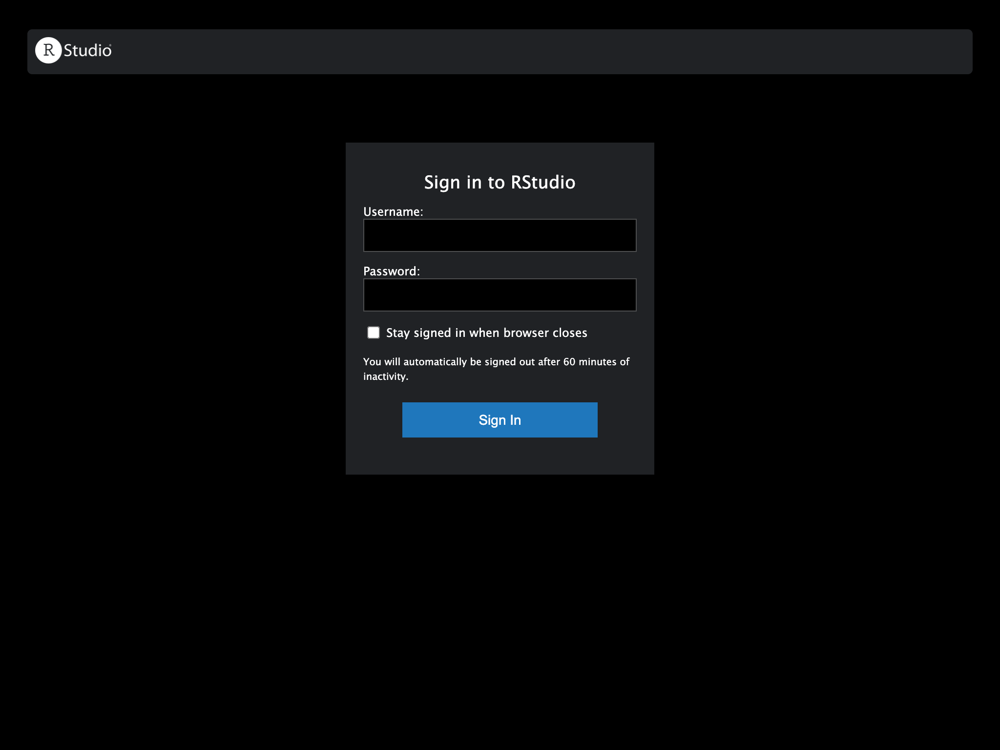
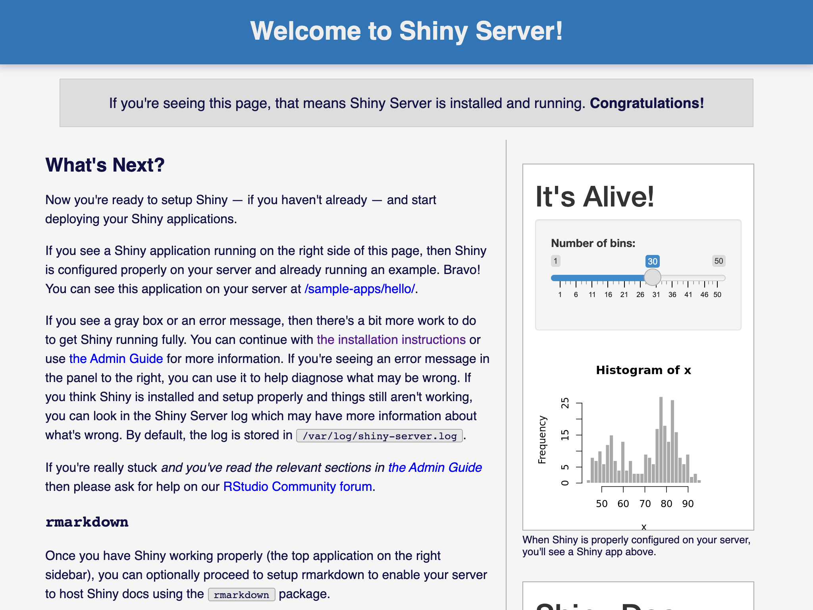

# RStudio & RShiny Server

## 事前準備

## R base

``` {.bash .prefixed}
sudo apt update
```

``` {.bash .prefixed}
sudo apt install software-properties-common dirmngr --yes
```

``` {.bash .prefixed}
wget -qO- https://cloud.r-project.org/bin/linux/ubuntu/marutter_pubkey.asc | sudo tee -a /etc/apt/trusted.gpg.d/cran_ubuntu_key.asc
```

``` {.bash .prefixed}
add-apt-repository "deb https://cloud.r-project.org/bin/linux/ubuntu $(lsb_release -cs)-cran40/"
```

``` {.bash .prefixed}
sudo apt install r-base --yes
```

## RStudio Server

### Step 1 --- 安裝 RStudio Server 伺服器

``` {.bash .prefixed}
sudo apt install gdebi-core
```

``` {.bash .prefixed}
cd /tmp && \
wget https://download2.rstudio.org/server/bionic/amd64/rstudio-server-1.4.1717-amd64.deb
```

``` {.bash .prefixed}
gpg --keyserver keyserver.ubuntu.com --recv-keys 3F32EE77E331692F
```

``` {.bash .prefixed}
sudo apt install dpkg-sig --yes
```

``` {.bash .prefixed}
dpkg-sig --verify rstudio-server-1.4.1717-amd64.deb
```

``` {.console_output}
Processing rstudio-server-1.4.1717-amd64.deb...
GOODSIG _gpgbuilder FE8564CFF1AB93F1728645193F32EE77E331692F 1621900692
```

``` {.bash .prefixed}
sudo gdebi rstudio-server-1.4.1717-amd64.deb
```

``` {.bash .prefixed}
sudo ufw allow 8787
```

``` {.bash .prefixed}
http://<虛擬主機的 ip 地址>:8787
```

### Step 2 --- 設定 Apache 的 Proxy

``` {.bash .prefixed}
sudo a2enmod proxy
sudo a2enmod proxy_http
sudo a2enmod proxy_wstunnel
```

``` {.bash .prefixed}
sudo vim /etc/apache2/sites-available/asis.conf
```

``` {.bash}
<VirtualHost *:80>
    ServerAdmin webmaster@localhost
    DocumentRoot /var/www/asis
    ErrorLog ${APACHE_LOG_DIR}/error.log
    CustomLog ${APACHE_LOG_DIR}/access.log combined

    ###
    # RStudio Proxy
    ###
    <proxy *>
    Allow from localhost
    </proxy>
    RedirectMatch permanent ^/rstudio$ /rstudio/
  
    RewriteEngine on
    RewriteCond %{HTTP:Upgrade} =websocket
    RewriteRule /rstudio/(.*)     ws://localhost:8787/$1  [P,L]
    RewriteCond %{HTTP:Upgrade} !=websocket
    RewriteRule /rstudio/(.*)     http://localhost:8787/$1 [P,L]
    ProxyPass /rstudio/ http://localhost:8787/
    ProxyPassReverse /rstudio/ http://localhost:8787/
    ProxyRequests Off
</VirtualHost>
```

``` {.bash .prefixed}
sudo systemctl restart apache2
```

    http://<虛擬主機的 ip 地址>/rstudio/



``` {.bash .prefixed}
sudo ufw status numbered
```

    Status: active

         To                         Action      From
         --                         ------      ----
    [ 1] 60000                      ALLOW IN    Anywhere                  
    [ 2] mosh                       ALLOW IN    Anywhere                  
    [ 3] Apache                     ALLOW IN    Anywhere                  
    [ 4] Apache Secure              ALLOW IN    Anywhere                  
    [ 5] 8787                       ALLOW IN    Anywhere                  
    [ 6] 60000 (v6)                 ALLOW IN    Anywhere (v6)             
    [ 7] mosh (v6)                  ALLOW IN    Anywhere (v6)             
    [ 8] Apache (v6)                ALLOW IN    Anywhere (v6)             
    [ 9] Apache Secure (v6)         ALLOW IN    Anywhere (v6)             
    [10] 8787 (v6)                  ALLOW IN    Anywhere (v6)

``` {.bash .prefixed}
sudo ufw delete 5
```

``` {.bash .prefixed}
sudo ufw delete 9
```

    Status: active

    To                         Action      From
    --                         ------      ----
    60000                      ALLOW       Anywhere                  
    mosh                       ALLOW       Anywhere                  
    Apache                     ALLOW       Anywhere                  
    Apache Secure              ALLOW       Anywhere                  
    60000 (v6)                 ALLOW       Anywhere (v6)             
    mosh (v6)                  ALLOW       Anywhere (v6)             
    Apache (v6)                ALLOW       Anywhere (v6)             
    Apache Secure (v6)         ALLOW       Anywhere (v6)

## RShiny Server

### Step 1 --- 安裝 RShiny Server

``` {.bash .prefixed}
sudo su - \
-c "R -e \"install.packages('shiny', repos='https://cran.rstudio.com/')\""
```

``` {.bash .prefixed}
cd /tmp && \
wget https://download3.rstudio.org/ubuntu-14.04/x86_64/shiny-server-1.5.16.958-amd64.deb
```

``` {.bash .prefixed}
sha256sum shiny-server-1.5.16.958-amd64.deb 
```

``` {.bash .prefixed}
sudo gdebi shiny-server-1.5.16.958-amd64.deb
```

::: {.infobox .info}
版本
:::



::: {.infobox .info}
右下角 blablabla 沒裝 rmarkdown package
:::

### Step 2 --- 設定 Apache 的 Proxy

``` {.bash .prefixed}
sudo vim /etc/apache2/sites-available/asis.conf
```

``` {.bash}
<VirtualHost *:80>
    [...]

    ###
    # RStudio Proxy
    ###
    [...]
    
    ###
    # RShiny Server Proxy
    ###
    RedirectMatch permanent ^/shiny$ /shiny/
    
    RewriteCond %{HTTP:Upgrade} =websocket
    RewriteRule /shiny/(.*) ws://localhost:3838/$1 [P,L]
    RewriteCond %{HTTP:Upgrade} !=websocket
    RewriteRule /shiny/(.*) http://localhost:3838/$1 [P,L]
    ProxyPass /shiny/ http://localhost:3838/
    ProxyPassReverse /shiny/ http://localhost:3838/
</VirtualHost>
```

    http://<虛擬主機的 ip 地址>/shiny/
