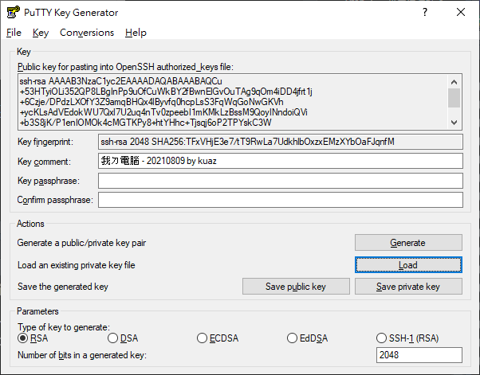

\cleardoublepage

# (APPENDIX) 附錄 {-}

# 相關軟體 {#related-software}

<!-- 因為內容太多，書本篇收錄的會變得太混雜，所以我把一些內容放到這裡。 -->

## Windows 終端機（Windows Terminal） {#windows-terminal}

Windows 終端機是一個屬於 Windows 系統由微軟提供的終端機程式。可以支援像是 Windows 子系統或是提供內建的命令提示字元或 PowerShell 使用。

首先至「[Windows 終端機商店](https://apps.microsoft.com/store/detail/windows-terminal/9N0DX20HK701)」頁面下載終端機

```{r, fig.cap='終端機商店官方介紹頁面'}
knitr::include_graphics(path = './figures/windows-terminal-page.png')
```

接著，畫面上應該會出現一個新的視窗，點選[取得]

```{r, fig.cap='終端機安裝'}
knitr::include_graphics(path = './figures/get-windows-terminal.png')
```

安裝完成後，自開始功能表搜尋「終端機」的字樣。

```{r, fig.cap='打開終端機'}
knitr::include_graphics(path = './figures/open-windows-terminal.png')
```

打開終端機後我們要進行設定，將 Windows 終端機設成預設終端機的啟動程式。點擊分頁旁邊的 `ᵛ` 展開選單，接著點選「設定」。

```{r, fig.cap='打開終端機'}
knitr::include_graphics(path = './figures/configure-windows-terminal_1.png')
```

找到「啟動」分頁後，將預設終端應用程式調整成「Windows 終端機」並儲存。

```{r, fig.cap='打開終端機'}
knitr::include_graphics(path = './figures/configure-windows-terminal_2.png')
```

接下來只要打開命令提示字元（cmd）或是 PowerShell 都會自動以 Windows 終端機打開。

## PuTTY {#putty}

使用 PuTTY 連線至 OpenSSH 伺服器

### 以 PuTTY 產生 key {#generate-key-with-putty}

另一個方法不會需要你手動安裝 OpenSSH Client，不過、一樣地，要安裝PuTTY 程式。

#### Step 1 --- 安裝 PuTTY

到開發者的網站，然後下載適合你 Windows 的版本 (副檔名為 \*.msi 的安裝程式)

-   <https://www.chiark.greenend.org.uk/~sgtatham/putty/latest.html>

根據你的需求設定安裝程式

{.figure}

待安裝程式安裝完成

{.figure}

安裝完成後，點選「開始」，找到 PuTTYgen開啟，或是點選「開始」，鍵入 `puttygen` 後按 Enter↩

#### Step 2 --- 經由 PuTTYgen 產生 ssh key pairs

跟 OpenSSH Client 一樣地，你可以在下方的 Types 選擇你偏好的加密方式。點選「Generate」開始產生 key，此時不要傻傻地在那邊等，要在程式進度條下方空白處隨意移動你的滑鼠鼠標。

{.figure}

完成後，可以在 Comment 的輸入框註解一下這個 key 是從哪裡來的，以後擁有多個 key pairs 時才不會搞混。當然你也可以用密碼保護這個 key pairs，如果有需要在 Key passphrase 與 Confirm passphrase 輸入一模一樣的密碼。

{.figure}

#### Step 3 --- 妥善保存好產生的 Key

分別按下「Save public key」與「Save private key」找到適合的地方儲存它。

### 上傳 ssh key pairs {#upload-ssh-key-pairs}

PuTTY 產生的 public key 與 private key 格式比較特別，並不能直接把 public key 裡面的文字直接貼到遠端電腦的 `~/.ssh/authorized_keys` 檔案裡面，需要經由 PuTTYgen.exe 讀取 \*.ppk 才能得到正確格式的 public key。首先把 PuTTYgen 程式打開。

{.figure}

接著按「Load」把剛剛產生的 \*.ppk 檔案讀取進來。會看到一行字「Public key for pasting into OpenSSH authorized_keys file」下面的可複製區域就是 public key，把它整段複製起來。

{.figure}

接著打開「PowerShell」或是「命令提示字元」，輸入:

``` {.powershell .prefixed_powershell}
echo "<YOUR_PUBLIC_KEY>" | ssh asis@192.168.0.13 "cat >> ~/.ssh/authorized_keys"
```

-   將 `<YOUR_PUBLIC_KEY>` 替換成自己的 public key

-   這裡的 `asis` 為第一章的[使用者設定](#使用者設定)的預設使用者

-   `192.168.0.13` 為我虛擬主機的 ip 位址，查詢 ip 位址可以先手動登入虛擬主機後，用 `hostname -I` 或是 `ip addr show` 指令查詢

接著按 Enter↩，跳出輸入密碼提示，這裡輸入預設的使用者密碼 `asis`

``` console_output
asis@192.168.0.13's password:
```

輸入完成不會出現任何訊息是正常的，代表操作沒有問題且已經可以使用 PuTTY 連線了。

### PuTTYgen 產生的 key pairs 的連線方式 {#connection-method-of-key-pairs-generated-by-puttygen}

SSH 連線方式大同小異:

-   首先點選「開始」，鍵入 `PuTTY` 打開客戶端

-   在左邊的 「Category:」 下，選取 「Session」

-   於 Host Name 輸入「使用者\@目的地 IP」，像是「`asis@192.168.0.13`」

    ::: {.infobox .info}
    你可以點選下面的「Default Settings」後，接著按「Save」會把剛剛輸入的 IP 與 Port 儲存至「Default Settings」內，當然你也可以自己取一個新的名字。
    :::

-   接著展開左邊 「Category:」 下的「Connection」 ➜ 點選「SSH」 ➜ 再點選「Auth」，於最下面的「Private key file for authentication:」點選「Browse...」選取 `*.ppk` 檔案位置

-   完成後點選「Open」連線

與使用 ssh 指令連線相同，都會先提醒你目的地是否正確。確認無誤按下「Accept」

{.figure}

連接成功!

{.figure}

<!-- ## 文本編輯器 -->

<!-- ### vim -->

<!-- ### nano -->