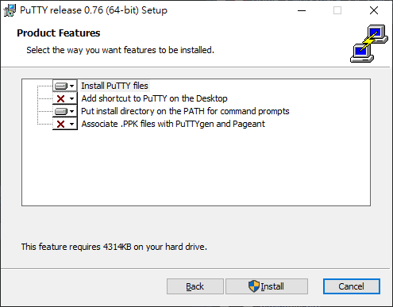
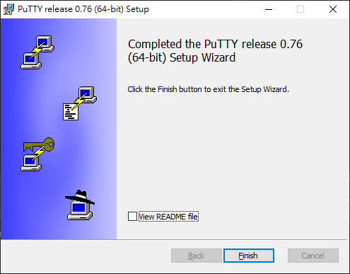
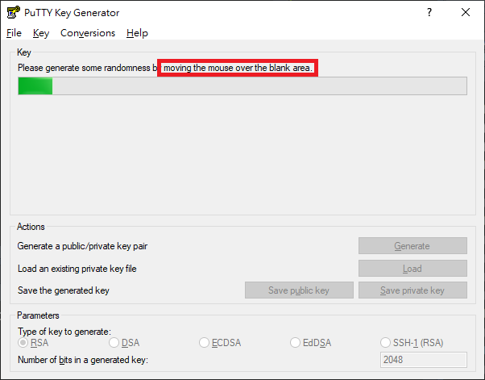
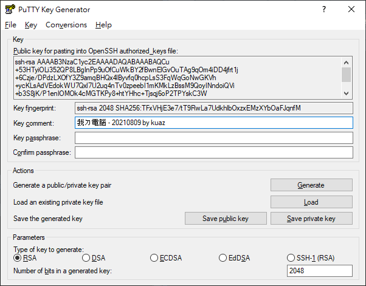
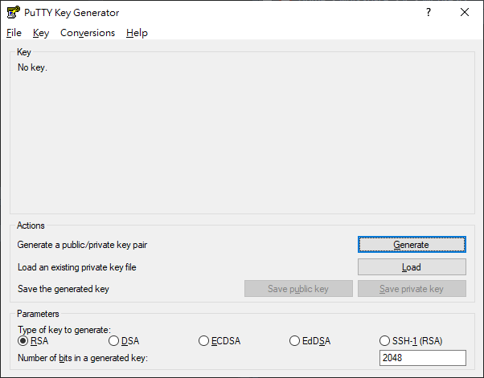
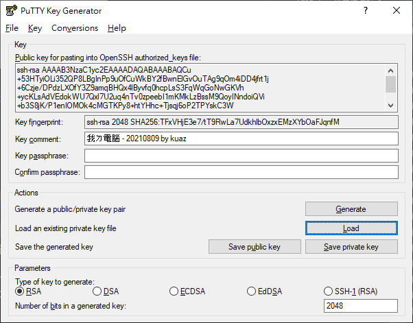
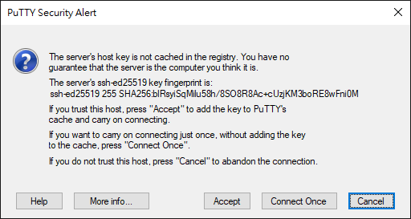
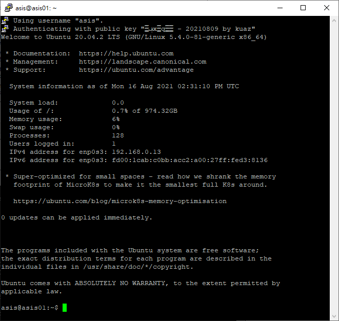

\cleardoublepage

# (APPENDIX) 附錄 {-}

# 相關軟體

<!-- 因為內容太多，書本篇收錄的會變得太混雜，所以我把一些內容放到這裡。 -->

## Windows 終端機（Windows Terminal） {#windows-terminal}

Windows 終端機是一個屬於 Windows 系統由微軟提供的終端機程式。可以支援像是 Windows 子系統或是提供內建的命令提示字元或 PowerShell 使用。

首先至「[Windows 終端機商店](https://apps.microsoft.com/store/detail/windows-terminal/9N0DX20HK701)」頁面下載終端機

```{r, fig.cap='終端機商店官方介紹頁面'}
knitr::include_graphics(path = './figures/windows-terminal-page.png')
```

接著，畫面上應該會出現一個新的視窗，點選[取得]

```{r, fig.cap='終端機安裝'}
knitr::include_graphics(path = './figures/get-windows-terminal.png')
```

安裝完成後，自開始功能表搜尋「終端機」的字樣。

```{r, fig.cap='打開終端機'}
knitr::include_graphics(path = './figures/open-windows-terminal.png')
```

打開終端機後我們要進行設定，將 Windows 終端機設成預設終端機的啟動程式。點擊分頁旁邊的 `ᵛ` 展開選單，接著點選「設定」。

```{r, fig.cap='打開終端機'}
knitr::include_graphics(path = './figures/configure-windows-terminal_1.png')
```

找到「啟動」分頁後，將預設終端應用程式調整成「Windows 終端機」並儲存。

```{r, fig.cap='打開終端機'}
knitr::include_graphics(path = './figures/configure-windows-terminal_2.png')
```

接下來只要打開命令提示字元（cmd）或是 PowerShell 都會自動以 Windows 終端機打開。

## PuTTY

使用 PuTTY 連線至 OpenSSH 伺服器

### 以 PuTTY 產生 key

另一個方法不會需要你手動安裝 OpenSSH Client，不過、一樣地，要安裝PuTTY 程式。

#### Step 1 --- 安裝 PuTTY

到開發者的網站，然後下載適合你 Windows 的版本 (副檔名為 \*.msi 的安裝程式)

-   <https://www.chiark.greenend.org.uk/~sgtatham/putty/latest.html>

根據你的需求設定安裝程式

{.figure}

待安裝程式安裝完成

{.figure}

安裝完成後，點選「開始」，找到 PuTTYgen開啟，或是點選「開始」，鍵入 `puttygen` 後按 Enter↩

#### Step 2 --- 經由 PuTTYgen 產生 ssh key pairs

跟 OpenSSH Client 一樣地，你可以在下方的 Types 選擇你偏好的加密方式。點選「Generate」開始產生 key，此時不要傻傻地在那邊等，要在程式進度條下方空白處隨意移動你的滑鼠鼠標。

{.figure}

完成後，可以在 Comment 的輸入框註解一下這個 key 是從哪裡來的，以後擁有多個 key pairs 時才不會搞混。當然你也可以用密碼保護這個 key pairs，如果有需要在 Key passphrase 與 Confirm passphrase 輸入一模一樣的密碼。

{.figure}

#### Step 3 --- 妥善保存好產生的 Key

分別按下「Save public key」與「Save private key」找到適合的地方儲存它。

### 上傳 ssh key pairs

PuTTY 產生的 public key 與 private key 格式比較特別，並不能直接把 public key 裡面的文字直接貼到遠端電腦的 `~/.ssh/authorized_keys` 檔案裡面，需要經由 PuTTYgen.exe 讀取 \*.ppk 才能得到正確格式的 public key。首先把 PuTTYgen 程式打開。

{.figure}

接著按「Load」把剛剛產生的 \*.ppk 檔案讀取進來。會看到一行字「Public key for pasting into OpenSSH authorized_keys file」下面的可複製區域就是 public key，把它整段複製起來。

{.figure}

接著打開「PowerShell」或是「命令提示字元」，輸入:

``` {.powershell .prefixed_powershell}
echo "<YOUR_PUBLIC_KEY>" | ssh asis@192.168.0.13 "cat >> ~/.ssh/authorized_keys"
```

-   將 `<YOUR_PUBLIC_KEY>` 替換成自己的 public key

-   這裡的 `asis` 為第一章的[使用者設定](#使用者設定)的預設使用者

-   `192.168.0.13` 為我虛擬主機的 ip 位址，查詢 ip 位址可以先手動登入虛擬主機後，用 `hostname -I` 或是 `ip addr show` 指令查詢

接著按 Enter↩，跳出輸入密碼提示，這裡輸入預設的使用者密碼 `asis`

``` console_output
asis@192.168.0.13's password:
```

輸入完成不會出現任何訊息是正常的，代表操作沒有問題且已經可以使用 PuTTY 連線了。

### PuTTYgen 產生的 key pairs 的連線方式:

SSH 連線方式大同小異:

-   首先點選「開始」，鍵入 `PuTTY` 打開客戶端

-   在左邊的 「Category:」 下，選取 「Session」

-   於 Host Name 輸入「使用者\@目的地 IP」，像是「`asis@192.168.0.13`」

    ::: {.infobox .info}
    你可以點選下面的「Default Settings」後，接著按「Save」會把剛剛輸入的 IP 與 Port 儲存至「Default Settings」內，當然你也可以自己取一個新的名字。
    :::

-   接著展開左邊 「Category:」 下的「Connection」 ➜ 點選「SSH」 ➜ 再點選「Auth」，於最下面的「Private key file for authentication:」點選「Browse...」選取 `*.ppk` 檔案位置

-   完成後點選「Open」連線

與使用 ssh 指令連線相同，都會先提醒你目的地是否正確。確認無誤按下「Accept」

{.figure}

連接成功!

{.figure}

<!-- ## 文本編輯器 -->

<!-- ### vim -->

<!-- ### nano -->

# 帳號管理

帳號管理分為兩個部分，一個部分是系統的帳號管理，另一個部分是 MySQL 資料庫的帳號管理。

## 系統帳號

這個小節會說明用來管理帳號的腳本的運作流程的活動圖、腳本運行，接著才是指令說明。如果要直接執行腳本請到 [腳本運行](#腳本運行) 的部分。

### 概述

本腳本（Bash Script）的活動圖，如圖 \@ref(fig:manage-users-sh) 所示。一開始會根據使用者設定的選項的設定環境，接著才會進到主要方法的部分。主要方法有兩種，分別是建立帳號（`create`）與刪除帳號（`delete`），這兩個方法隨後會另外說明。

```{r manage-users-sh, fig.cap='manage-users.sh', out.width='40%'}
knitr::include_graphics(path = './figures/manage-users.sh.svg')
```

### 腳本運行 {#腳本運行}

這個部分會說明怎麼執行腳本。

首先先切換使用者目錄到家目錄底下的 `~/bin`

``` {.bash .prefixed}
cd ~/bin
```

再來用你喜愛的編輯器在這個目錄底下新增一個叫做 `manage-users.sh` 的腳本（Bash Script）

``` {.bash .prefixed}
vim manage-users.sh
```

將藏在 ▶ 裡面的腳本內容放到腳本內後儲存

```{=html}
<details>
  <summary>
    管理使用者的腳本
  </summary>
  <p>
```
::: code-label
\~/bin/manage-users.sh
:::

``` bash
#!/bin/bash
# author: kuaz
# created date: 2022.02.24
# last modified: 2022.07.11
# 
# This script is used to:
# 1. Create user accounts from /depts/dept.txt files (one student ID per line).

# 環境變數
depts_dir='depts'       # 放置用來建置 linux 帳號的系資料夾
# pass_dir='passwd'       # 放置建置完成的 linux 帳號密碼的資料夾
gp=false                # 是否產生新密碼
new=true                # 是否是新版的 shiny app 連結方式；如果設為 true，
                        # 將不會使用 systemetic link 的方式連結
dryrun=false            # 試運行；如果設為 true，將不會創立帳號
                        # useradd 是否支援 badname
badname_supported=$(useradd 2>&1 | grep -q "badname"; echo $?)    

check_permission() {
    if [ ${dryrun} == true ]; then
        :
    else
        if [ $(id -u) -ne 0 ]; then
            echo "必須以 root 權限執行此腳本！";
            exit 1;
        fi
    fi
}

user_exists() { 
    id "$1" &> /dev/null 
}

check_depts_dir() {
    if [ -d ${depts_dir} ]; then
        grps="$(ls ./${depts_dir} | grep ".txt" | cut -d "." -f 1)"
        for grp in ${grps}
        do
            # https://stackoverflow.com/questions/28038633/wc-l-is-not-counting-last-of-the-file-if-it-does-not-have-end-of-line-character
            count=$(awk 'END{print NR}' ./${depts_dir}/${grp}.txt)
            file=$(realpath ./${depts_dir}/${grp}.txt)
            if [ $count -lt 1 ]; then
                echo "請再檢查一次 ${depts_dir} 內是否含有正確格式的學號檔案！"
                echo "有問題的檔案: $file"
                exit 1
            else
                echo "於 $file 發現了 $count 個學生"
            fi
        done
    else
        echo "系資料夾 ${depts_dir} 不存在！請先手動創建或是由選項 -c, --generate-configuration 建立。"
        exit 1;
    fi
}

# create_pass_dir() {
#     if [ ! -d ${pass_dir} ]; then
#         echo "存放密碼的 ${pass_dir} 資料夾不存在，將建立 ${pass_dir} 資料夾"
#         mkdir ${pass_dir}
#     else
#         read -p "存放密碼的 ${pass_dir} 資料夾已存在！是否要將其移除後繼續建立帳號? (yes/No)" yn
#         case $yn in
#             [Yy]* ) 
#                 rm -rf ${pass_dir}
#                 make_pass_dir
#             ;;
#             [Nn]* ) exit 1;;
#         esac
#     fi
# }

create_users() {
    # 如果有產生密碼的需求
    # if [ ${gp} = true ]; then
    #     create_pass_dir
    # fi

    for grp in ${grps}
    do
        # 確認使用者群組是否存在，如果不存在將自動建立
        if $(grep -q "^${grp}:" /etc/group); then
            :
        else
            # 非試運行
            if [ ${dryrun} = false ]; then
                groupadd ${grp}
            fi
            echo "已建立 ${grp} 使用者群組"
        fi
    done

    for grp in ${grps}
    do 
        # 使用舊方法連結 ShinyApps
        if [ ${new} = false ] && [ ! -d /srv/shiny-server/${grp} ]; then
            echo "/srv/shiny-server/${grp} 資料夾不存在，將建立群組資料夾"
            # 非試運行
            if [ ${dryrun} = false ]; then
                mkdir /srv/shiny-server/${grp}
            fi
        fi

        created=0
        skip=0

        # 逐行讀取學號
        while IFS= read -r stu || [ -n "$stu" ];
        do
            cur_user=${stu}

            if user_exists "${cur_user}"; then
                (( skip += 1 ))
            
            elif [ ${dryrun} = false ]; then
                # 如果不支援 badname
                if [ ${badname_supported} == false ]; then
                    useradd -N -g stu -G ${grp} -m ${cur_user}
                else
                    useradd --badnames -N -g stu -G ${grp} -m ${cur_user}
                fi

                # 產生隨機密碼
                # if [ ${gp} = false ]; then
                cur_user_password=${cur_user}
                # else
                #     cur_user_password=$(openssl rand -base64 6)
                # fi
                
                # 以 root 權限創立使用者帳號，並設定密碼
                echo "${cur_user}:${cur_user_password}" | chpasswd

                # 將設定的帳號密碼儲存一份到資料夾中
                # echo "${cur_user},${cur_user_password}"| tee -a ./${pass_dir}/${grp}.csv > /dev/null 2>&1

                # 將 ShinyApp 軟連結至使用者資料夾
                if [ ${new} = false ]; then
                    # 需要先在 /etc/skel/ 建立 ShinyApps 資料夾，才可成功連結
                    ln -s /home/${cur_user}/ShinyApps /srv/shiny-server/${grp}/${cur_user}
                fi

                (( created += 1 ))
            else
                # 如果為試運行模式
                (( created += 1 ))
            fi

        done < ./${depts_dir}/${grp}.txt

        echo "成功從群組 ${grp} 建立了 ${created} 個帳號，忽略了 ${skip} 個已存在帳號。"
    done
}

delete_users() {
    for grp in ${grps}
    do 
        skip=0
        deleted=0
        while IFS= read -r stu || [ -n "$stu" ];
        do
            cur_user=${stu}
            if user_exists "${cur_user}"; then
                userdel -r ${cur_user} > /dev/null 2>&1
                if [ ${new} = false ]; then
                    rm -rf /srv/shiny-server/${grp}/${stu}
                fi
                (( deleted += 1 ))
            else
                (( skip += 1 ))
            fi
        done < ./${depts_dir}/${grp}.txt
        echo "成功從群組 ${grp} 移除了 ${deleted} 個帳號，其中共有 ${skip} 個帳號不存在。"
    done
    # read -p "使用者已移除，是否要順便移除存放密碼的資料夾 ${pass_dir}? (yes/No)" yn

    # case $yn in
    #     [Yy]* ) 
    #         rm -rf ${pass_dir}
    #     ;;
    #     [No]* ) exit 0;;
    # esac
}

create_prompt() {
    read -p "即將建立使用者帳戶，確認使用者資料是否無誤?（Yes/No）" yn
    echo 

    case $yn in
        [Yy]* ) create_users;;
        [Nn]* ) exit 0;;
    esac
}

delete_prompt() {
    read -p "即將 '刪除' 使用者帳戶，於 /home/<使用者> 的資料將會消失，是否執行?（Yes/No）" yn
    case $yn in
        [Yy]* ) delete_users;;
        [Nn]* ) exit 0;;
    esac
}

generate_configuration() {
    if [ -d ${depts_dir} ]; then
        echo "資料夾已存在！請先刪除 ${depts_dir} 資料夾"
    else
        mkdir ${depts_dir}
        touch ${depts_dir}/asis.txt
        touch ${depts_dir}/eco.txt
        echo 08170875 > ${depts_dir}/asis.txt
        echo 08220855 > ${depts_dir}/eco.txt
        echo "設定檔案建立完成"
    fi
    exit 0;
}

display_help() {
    cat << EOF
使用方法: $0 [ 選項... ] < create | delete >

選項: 
    -h, --help                      產生此說明文字
    -d, --dry-run                   試運行腳本，不實際執行
    -c, --generate-configuration    產生範例設定
    -o, --old-shiny-server          ShinyApps 將使用軟連結的方式連結（不推薦）
EOF
}

while :
do
    case "$1" in
        -h | --help)
            display_help
            exit 0
        ;;
        -d | --dry-run)
            dryrun=true
            shift 1
            break
        ;;
        # -p | --generate-password)
        #     gp=true
        #     shift 1
        #     break
        # ;;
        -c | --generate-configuration)
            generate_configuration
            exit 0
        ;;
        -o | --old-shiny-server)
            new=false
            shift 1
            break
        ;;
        -*)
            echo "錯誤：未知的選項：$1"
            display_help
            exit 1
        ;;
        *)
            break
        ;;
    esac
done

case "$1" in
    create)
        check_permission
        check_depts_dir
        create_prompt
    ;;
    delete)
        check_permission
        check_depts_dir
        delete_prompt
    ;;
    *)
        echo "錯誤，請參考下列指令說明："
        echo 
        display_help
        exit 1
    ;;
esac
```

```{=html}
  </p>
</details>
```
接著使用 `chmod` 指令為腳本加上可執行的權限

``` {.bash .prefixed}
chmod +x manage-users.sh
```

使用腳本名稱加上 `-h` 或是 `--help` 選項可以顯示使用腳本的說明哦～

``` {.bash .prefixed}
./manage-users.sh --help
```

``` console_output
使用方法: ./manage-users.sh [選項...] <create | delete>

選項:
    -h, --help                      產生此說明文字
    -d, --dry-run                   試運行腳本，不實際執行
    -c, --generate-configuration    產生範例設定
    -o, --old-shiny-server          ShinyApps 將使用軟連結的方式連結（不推薦）
```

如果是第一次使用此腳本，可以使用 `-c` 選項產生範例設定

``` {.bash .prefixed}
./manage-users.sh -c
```

``` console.output
├── depts
│   ├── asis.txt
│   └── eco.txt
└── manage-users.sh
```

這個腳本會根據所設定的系資料夾新增帳號，新增的使用者帳號的主要使用者群組是 `stu`，副使用者群組為 `.txt` 的名稱，這一點要多加注意。

預設腳本產生的資料有兩個帳號，分別是屬於使用者群組 `asis` 的 `08170875` 與屬於使用者群組 `eco` 的 `08220855`。

接著使用 `sudo` 權限建立使用者帳號

``` {.bash .prefixed}
sudo ./manage-users.sh create
```

``` console_output
於 /home/kuaz/Downloads/depts/asis.txt 發現了 1 個學生
於 /home/kuaz/Downloads/depts/eco.txt 發現了 1 個學生
即將建立使用者帳戶，確認使用者資料是否無誤?（Yes/No）
```

這時候會預覽在檔案中發現的使用者數目，此時輸入 Yes/No 可以繼續或是中斷腳本，這裡選擇繼續所以輸入 `Y` 後按 Enter↩。

完成後也會提示建立帳號的說明

``` console_output
成功從群組 asis 建立了 1 個帳號，忽略了 0 個已存在帳號。
成功從群組 eco 建立了 1 個帳號，忽略了 0 個已存在帳號。
```

完成後可以用指令 `id` 確認使用者有無成功建立

``` {.bash .prefixed}
id 08170875; id 08220855
```

``` console_output
uid=1026(08170875) gid=1006(stu) groups=1006(stu),1007(asis)
uid=1027(08220855) gid=1006(stu) groups=1006(stu),1005(eco)
```

測試完後可以用腳本附帶的 `detele` 方法刪除帳號

``` {.bash .prefixed}
sudo ./manage-users.sh delete
```

與建立帳號相同，刪除帳號一樣會有提示，這裡也是輸入 `Y` 後繼續刪除帳號的方法

``` console_output
於 /home/kuaz/Downloads/depts/asis.txt 發現了 1 個學生
於 /home/kuaz/Downloads/depts/eco.txt 發現了 1 個學生
即將 '刪除' 使用者帳戶，於 /home/<使用者> 的資料將會消失，是否執行?（Yes/No）
```

``` console_output
成功從群組 asis 移除了 1 個帳號，其中共有 0 個帳號不存在。
成功從群組 eco 移除了 1 個帳號，其中共有 0 個帳號不存在。
```

再用相同的指令確認使用者是否存在

``` {.bash .prefixed}
id 08170875; id 08220855
```

提示使用者不存在

``` console_output
id: ‘08170875’: no such user
id: ‘08220855’: no such user
```

### 指令說明

#### 讀取選項的迴圈

首先是第一個迴圈，第一個迴圈是檢查選項用的，這裡使用的是 Bash Script 的 Case 語法（類似 Switch 的概念）。

``` bash
while :
do
    case "$1" in
        -h | --help)
            display_help
            exit 0
        ;;
        -d | --dry-run)
            dryrun=true
            shift 1
            break
        ;;
        # -p | --generate-password)
        #     gp=true
        #     shift 1
        #     break
        # ;;
        -c | --generate-configuration)
            generate_configuration
            exit 0
        ;;
        -o | --old-shiny-server)
            new=false
            shift 1
            break
        ;;
        -*)
            echo "錯誤：未知的選項：$1"
            display_help
            exit 1
        ;;
        *)
            break
        ;;
    esac
done
```

首先 `while :` 的意思在 Bash Script 裡面就是 `while true` 的意思。而 **do-done** 是接續 while 的語句。接著會碰到 `$1`，`$1` 代表的是指令以空白區隔，第一個位置的參數在 Bash Script 裡面就會被設為 `$1`，例如：

``` {.bash .prefixed}
./manage-users.sh -c
```

所以這裡的 `$1` 就代表著第一個參數位置，`-c`。所以當腳本碰到 `-` 開頭的選項時，就會落到 Case 的 Pattern 裡面去匹配選項。那為什麼腳本丟到 Case 裡面的變數一直都是 `$1` 也可以跑？是因為搭配了 `shift 1` 指令，當腳本碰到 `shift 1`，它會將 `$1` 丟棄，`$2` 遞補上來變為 `$1`，直到遇到其他終止的條件，像是 `break` 或是 `exit`。

#### 讀取方法的 Switch Case

一樣的，這裡會用到相同的 Switch Case 概念，假如上一個迴圈被 `break` 終止後，且 `$1` 被包含在 Switch Case 的選項中就會觸發對應的方法。這裡我針對 `create` 與 `delete` 設定了不同的方法。

``` bash
case "$1" in
    create)
        check_permission
        check_depts_dir
        create_prompt
    ;;
    delete)
        check_permission
        check_depts_dir
        delete_prompt
    ;;
    *)
        echo "錯誤，請參考下列指令說明："
        echo 
        display_help
        exit 1
    ;;
esac
```

建立使用者會依序呼叫 3 個方法，分別是 `check_permission`（檢查權限是否為 root）、`check_depts_dir`（檢查系資料夾是否符合規範）最後才是 `create_prompt` （建立使用者提示）。

<!--# TODO: 這裡可以再增加範例 -->

#### 建立使用者

建立使用者的流程如下圖，圖 \@ref(fig:create-users) 活動圖所示：

```{r create-users, fig.cap='建立使用者', out.width='80%'}
knitr::include_graphics(path = './figures/create-users.svg')
```

這裡用到非常多的 if 判斷環境，所以本腳本還有很多改善的空間。

##### 檢查權限（`check_permission`）方法：

``` {.bash .numberLines}
check_permission() {
    if [ ${dryrun} == true ]; then
        :
    else
        if [ $(id -u) -ne 0 ]; then
            echo "必須以 root 權限執行此腳本！";
            exit 1;
        fi
    fi
}
```

這段程式碼做了：

-   第 **1** 行，方法名稱

-   第 **2** 行，檢查變數 `dryrun`（試運行）是否為 `true`。如果試運行選項有設定時，會直接略過這個 **if** 語句。

-   第 **3** 行，`:` 在腳本中代表的是 `true` 的別名，因為 if 與句不能為空，所以這裡放一個 `:`。詳細說明可以參考[這裡](https://stackoverflow.com/questions/3224878/what-is-the-purpose-of-the-colon-gnu-bash-builtin/3224910#3224910)

-   第 **5** 行，檢查當前的使用者編號是否為 `0`，這裡的 `0` 是代表 `root`。

-   第 **6** 行，輸出訊息

-   第 **7** 行，結束程式，錯誤代碼為 `1`

##### 檢查系資料夾是否符合規範（`check_depts_dir`）

``` {.bash .numberLines}
check_depts_dir() {
    if [ -d ${depts_dir} ]; then
        grps="$(ls ./${depts_dir} | grep ".txt" | cut -d "." -f 1)"
        for grp in ${grps}
        do
            count=$(awk 'END{print NR}' ./${depts_dir}/${grp}.txt)
            file=$(realpath ./${depts_dir}/${grp}.txt)
            if [ $count -lt 1 ]; then
                echo "請再檢查一次 ${depts_dir} 內是否含有正確格式的學號檔案！"
                echo "有問題的檔案: $file"
                exit 1
            else
                echo "於 $file 發現了 $count 個學生"
            fi
        done
    else
        echo "系資料夾 ${depts_dir} 不存在！請先手動創建或是由選項 -c, --generate-configuration 建立。"
        exit 1;
    fi
}
```

這段程式碼做了：

-   第 **1** 行，方法名稱

-   第 **2** 行，檢查資料夾 `depts` 是否存在

-   第 **3** 行，`ls` 會列出於 `depts` 資料夾中所有的檔案，`|` 會將前一個指令的結果傳到下一個指令裡面，`grep ".txt"` 會抓出含有 .txt 的檔案，接著最後的 `cut -d "." -f 1` 會將資料以 . 作為分隔符號切割，取出第一個結果。例如資料夾中有著三個 .txt 的檔案，`asis.txt`、`eco.txt`與 `fin.txt`，最後輸出的結果為：`asis`、`eco` 與 `fin`。

-   第 **4-5** 行，將前一個結果放到 For 迴圈中。

-   第 **6** 行，`awk` 是一種文字處理工具，這裡的功用是計算系資料中的檔案有幾列（不包含空行），估算要建立的使用者數目。

-   第 **7** 行，`realpath` 會將檔案完整的路進印出來，並儲存在變數 `file` 中

-   第 **8** 行，**if** 語句，如果數量少於 1

-   第 **9-11** 行，輸出訊息並中止

-   第 **13** 行，輸出訊息

-   第 **17-18** 行，輸出訊息並中止

##### 建立使用者提示（`create_prompt`）

``` {.bash .numberLines}
create_prompt() {
    read -p "即將建立使用者帳戶，確認使用者資料是否無誤?（Yes/No）" yn
    echo 

    case $yn in
        [Yy]* ) create_users;;
        [Nn]* ) exit 0;;
    esac
}
```

這段程式碼做了：

-   第 **1** 行，方法名稱

-   第 **2** 行，讀取使用者輸入，並儲存到變數 `yn` 中

-   第 **5** 行，Switch Case 語句

-   第 **6** 行，當第一個字母為 `Y` 或是 `y` 會落到此語句，並執行 `create_users` 方法

-   第 **7** 行，當第一個字母為 `N` 或是 `n` 會落到此語句，直接退出程式

##### 建立使用者（`create_users`）

``` {.bash .numberLines}
create_users() {
    # 如果有產生密碼的需求
    # if [ ${gp} = true ]; then
    #     create_pass_dir
    # fi

    for grp in ${grps}
    do
        # 確認使用者群組是否存在，如果不存在將自動建立
        if $(grep -q "^${grp}:" /etc/group); then
            :
        else
            # 非試運行
            if [ ${dryrun} = false ]; then
                groupadd ${grp}
            fi
            echo "已建立 ${grp} 使用者群組"
        fi
    done

    for grp in ${grps}
    do 
        # 使用舊方法連結 ShinyApps
        if [ ${new} = false ] && [ ! -d /srv/shiny-server/${grp} ]; then
            echo "/srv/shiny-server/${grp} 資料夾不存在，將建立群組資料夾"
            # 非試運行
            if [ ${dryrun} = false ]; then
                mkdir /srv/shiny-server/${grp}
            fi
        fi

        created=0
        skip=0

        # 逐行讀取學號
        while IFS= read -r stu || [ -n "$stu" ];
        do
            cur_user=${stu}

            if user_exists "${cur_user}"; then
                (( skip += 1 ))
            
            elif [ ${dryrun} = false ]; then
                # 如果不支援 badname
                if [ ${badname_supported} == false ]; then
                    useradd -N -g stu -G ${grp} -m ${cur_user}
                else
                    useradd --badnames -N -g stu -G ${grp} -m ${cur_user}
                fi

                # 產生隨機密碼
                # if [ ${gp} = false ]; then
                cur_user_password=${cur_user}
                # else
                #     cur_user_password=$(openssl rand -base64 6)
                # fi
                
                # 以 root 權限創立使用者帳號，並設定密碼
                echo "${cur_user}:${cur_user_password}" | chpasswd

                # 將設定的帳號密碼儲存一份到資料夾中
                # echo "${cur_user},${cur_user_password}"| tee -a ./${pass_dir}/${grp}.csv > /dev/null 2>&1

                # 將 ShinyApp 軟連結至使用者資料夾
                if [ ${new} = false ]; then
                    # 需要先在 /etc/skel/ 建立 ShinyApps 資料夾，才可成功連結
                    ln -s /home/${cur_user}/ShinyApps /srv/shiny-server/${grp}/${cur_user}
                fi

                (( created += 1 ))
            else
                # 如果為試運行模式
                (( created += 1 ))
            fi

        done < ./${depts_dir}/${grp}.txt

        echo "成功從群組 ${grp} 建立了 ${created} 個帳號，忽略了 ${skip} 個已存在帳號。"
    done
}
```

這段程式碼做了：

-   第 **1** 行，方法名稱

-   第 **7** 行，根據 `check_depts_dir` 產生的變數 `grps` 做 **For** 迴圈

-   第 **10** 行，檢查當前 **For** 迴圈群組使否存在

-   第 **11** 行，`:` 在腳本中代表的是 `true` 的別名，因為 if 與句不能為空，所以這裡放一個 `:`。詳細說明可以參考[這裡](https://stackoverflow.com/questions/3224878/what-is-the-purpose-of-the-colon-gnu-bash-builtin/3224910#3224910)

-   第 **14** 行，檢查 `dryrun`（試運行）變數

-   第 **15** 行，新增使用者群組

-   第 **21** 行，根據 `check_depts_dir` 產生的變數 `grps` 做 **For** 迴圈

-   第 **24** 行，檢查 `new`（是否使用新方法創建 ShinyApps 資料夾）與 `/srv/shiny-server/群組名稱`

-   第 **25** 行，輸出訊息

-   第 **27** 行，檢查 `dryrun`（試運行）變數

-   第 **28** 行，建立使用者群組

-   第 **32-33** 行，初始化變數，`created` 用來計算成功建立的使用者，`skip` 是用來計算已經存在的使用者。

-   第 **36-37、76** 行，逐行讀入指定的檔案，`< ./${depts_dir}/${grp}.txt`，這裡會逐行讀入係檔案的學號，每行代表一個要建立的使用者，並儲存到 `stu` 變數中。

    ``` bash
    while IFS= read -r stu || [ -n "$stu" ];
    do
        [ 省略... ]
    done < ./${depts_dir}/${grp}.txt
    ```

-   第 **38** 行，複製一個 `stu` 變數儲存到 `cur_stu` 變數中

-   第 **40** 行，用方法 `user_exists` 判斷使用者是否存在，隨後的是方法是輸入變數

-   第 **41** 行，變數 `skip` 加 1

-   第 **43** 行，檢查 `dryrun`（試運行）變數

-   第 **45** 行，檢查 `badname_supported` 變數

-   第 **46** 行，使用 `useradd` 指令建立使用者，參數說明如下：

    -   `-N, --no-user-group`：不建立使用者的個人使用者群組，須與 `-g` 同時使用

    -   `-g, --gid 群組`：指定使用者的主要群組

    -   `-G, --groups 群組1[, 群組2, ...[,群組N]]`：指定使用者的副群組

    -   `-m, --create-home`：建立使用者的家目錄

-   第 **48** 行，多了 `--badnames` 選項，為了使不安全命名方式的使用者成功建立，例如數字開頭的使用者。

-   第 **53** 行，設定 `cur_user_password`（使用者密碼）變數為 `cur_user`（目前的使用者）變數

-   第 **59** 行，使用 `chpasswd` 變更 `cur_user`（目前的使用者）的使用者密碼

-   第 **65** 行，檢查 `new`（是否使用新方法創建 ShinyApps 資料夾）

-   第 **67** 行，將 ShinyApp 軟連結至使用者資料夾

-   第 **70、73** 行，變數 `created` 加 1

-   第 **78** 行，輸出訊息

<!-- ## 資料庫（MySQL）帳號 -->

<!-- ### 概述 -->

<!-- ``` bash -->
<!-- #!/bin/bash -->
<!-- # author: kuaz -->
<!-- # last modified: 2021.09.13 -->
<!-- #  -->
<!-- # 這個腳本被用來: -->
<!-- # 1. 根據已知的帳號密碼建立 MySQL 帳戶 -->
<!-- # 2. 根據帳號建立資料庫，編碼為 'utf8mb4' -->
<!-- # 3. 以上指令會儲存在當前資料夾的 create-account.sql 裡面 -->
<!-- # 4. 根據已知的帳號刪除該 MySQL 帳戶與資料庫 -->
<!-- # 5. 若加上 -r, --run 即可順便執行該腳本 -->


<!-- # 環境變數 -->
<!-- pass_dir='passwd'       # 放置密碼的資料夾，由另一個腳本 ./create-users.sh 產生 -->
<!-- filename='-accounts.sql'  # create/drop-accounts.sql 檔案前綴會根據選項變化 -->
<!-- run=false           # 預設產生腳本後不會執行 -->

<!-- check_pass_dir() { -->
<!--   if [ -d ${pass_dir} ]; then -->
<!--         grps="$(ls ${pass_dir} | grep ".csv" | cut -d "." -f 1)" -->
<!--   else -->
<!--         echo "密碼資料夾 ${pass_dir} 不存在！請先執行過建立帳號腳本（create-users.sh）後，再執行一次此腳本。" -->
<!--         exit 1; -->
<!--   fi -->
<!-- } -->

<!-- write_to_mysql_db() { -->
<!--   if [ ${run} = true ]; then -->
<!--         echo "請輸入 MySQL 帳戶 root 的密碼: 👇" -->
<!--         mysql -u root -p < ${filename} -->
<!--         clean_sql_script -->
<!--   else -->
<!--         echo "已於 $(pwd) 產生 ${filename} 🎉" -->
<!--   fi -->
<!-- } -->

<!-- create_users_and_databases() { -->
<!--   echo "set global validate_password.policy=LOW;" | tee -a ${filename} > /dev/null 2>&1; -->
<!--   for grp in ${grps} -->
<!--     do  -->
<!--         while read line; -->
<!--         do -->
<!--             stu="$(echo ${line} | cut -d ',' -f 1)" -->
<!--             pass="$(echo ${line} | cut -d ',' -f 2)" -->
<!--             echo "create user '${stu}'@'localhost' identified by '${pass}';" \ -->
<!--                 | tee -a ${filename} > /dev/null 2>&1 -->
<!--             echo "create database \`${stu}\` character set utf8mb4 collate utf8mb4_unicode_ci;" \ -->
<!--                 | tee -a ${filename} > /dev/null 2>&1 -->
<!--             echo "grant all privileges on \`${stu}\`.* to '${stu}'@'localhost';" \ -->
<!--                 | tee -a ${filename} > /dev/null 2>&1 -->
<!--         done < ${pass_dir}/${grp}.csv -->
<!--   done -->
<!--   echo "flush privileges;" | tee -a ${filename} > /dev/null 2>&1; -->
<!--   write_to_mysql_db -->
<!-- } -->

<!-- drop_users_and_databases() { -->
<!--   for grp in ${grps} -->
<!--     do  -->
<!--         while read line; -->
<!--         do -->
<!--             stu="$(echo ${line} | cut -d ',' -f 1)" -->
<!--             echo "drop user '${stu}'@'localhost';" \ -->
<!--                 | tee -a ${filename} > /dev/null 2>&1 -->
<!--             echo "drop database \`${stu}\`;" \ -->
<!--                 | tee -a ${filename} > /dev/null 2>&1 -->
<!--         done < ${pass_dir}/${grp}.csv -->
<!--   done -->
<!--   write_to_mysql_db -->
<!-- } -->

<!-- display_help() { -->
<!--   echo "這個腳本被用來:" -->
<!--   echo "1. 根據已知的帳號密碼建立 MySQL 帳戶" -->
<!--   echo "2. 根據帳號建立資料庫，編碼為 'utf8mb4'" -->
<!--   echo "3. 以上指令會儲存在當前資料夾的 create-account.sql 裡面" -->
<!--   echo "4. 根據已知的帳號刪除該 MySQL 帳戶與資料庫" -->
<!--   echo "5. 若加上 -r, --run 即可順便執行該腳本" -->
<!--   echo -->
<!--   echo "使用方法: $0 [option...] {create|drop}" -->
<!--   echo -->
<!--   echo "options: " -->
<!--   echo "  -r, --run  執行腳本" -->
<!--   echo "  -h, --help  顯示說明" -->
<!--   echo "  沒有加任何選項: 僅產生 .sql 腳本" -->
<!--   echo -->
<!--   exit 0 -->
<!-- } -->

<!-- clean_sql_script() { -->
<!--   read -p "是否要清除 ${filename}? (Yes/No)" yn -->
<!--   case $yn in -->
<!--         [Yy]* ) rm ${filename} ;; -->
<!--         [Nn]* ) exit 0;; -->
<!--   esac -->
<!--   echo "DONE 🎉" -->
<!-- } -->

<!-- while : -->
<!-- do -->
<!--   case "$1" in -->
<!--         -r | --run) -->
<!--             run=true -->
<!--             shift 1 -->
<!--             ;; -->
<!--         -h | --help) -->
<!--             display_help -->
<!--             exit 0 -->
<!--             ;; -->
<!--         --) -->
<!--             shift -->
<!--             break -->
<!--             ;; -->
<!--         -*) -->
<!--             echo "錯誤: 未知的選項: $1" >&2 -->
<!--             display_help -->
<!--             exit 1 -->
<!--             ;; -->
<!--         *) -->
<!--             break -->
<!--             ;; -->
<!--     esac -->
<!-- done -->
<!-- case "$1" in -->
<!--   create) -->
<!--         check_pass_dir -->
<!--         if [ $? -ne 1 ]; then -->
<!--             filename="$1$filename" -->
<!--             create_users_and_databases -->
<!--         fi -->
<!--         ;; -->
<!--     drop) -->
<!--         check_pass_dir -->
<!--         if [ $? -ne 1 ]; then -->
<!--             filename="$1$filename" -->
<!--             drop_users_and_databases -->
<!--         fi -->
<!--         ;; -->
<!--     *) -->
<!--         display_help -->
<!--         exit 0 -->
<!--         ;; -->
<!-- esac -->
<!-- ``` -->

# 其他

## 更改預設的文本編輯器

這個指令可以變更系統編輯文件所用的程式

``` bash
sudo update-alternatives --config editor
```

按了 Enter↩ 之後，會出現現在可用的編輯器，輸入對應的編號即可變更。有標 `*` 號的編輯器為目前設定的預設編輯器。

``` console_output
There are 4 choices for the alternative editor (providing /usr/bin/editor).

  Selection    Path                Priority   Status
------------------------------------------------------------
  0            /bin/nano            40        auto mode
  1            /bin/ed             -100       manual mode
  2            /bin/nano            40        manual mode
* 3            /usr/bin/vim.basic   30        manual mode
  4            /usr/bin/vim.tiny    15        manual mode

Press <enter> to keep the current choice[*], or type selection number: 3
```

<!--# TODO: 利用 SSH  傳輸檔案 -->

<!--## sharedfolder-->

## 關於套件版本

### Step 1 --- 安裝 php & php-mysql 插件

先確認 `php` 是不是我們要安裝的版本

``` {.bash .prefixed}
sudo apt info php
```

可以看到，目前 `php` 的依賴套件是 `php7.4`，代表將安裝的版本為 `php7.4`

``` console_output
Package: php
Version: 2:7.4+75
Priority: optional
Section: php
Source: php-defaults (75)
Origin: Ubuntu
Maintainer: Ubuntu Developers <ubuntu-devel-discuss@lists.ubuntu.com>
Original-Maintainer: Debian PHP Maintainers <team+pkg-php@tracker.debian.org>
Bugs: https://bugs.launchpad.net/ubuntu/+filebug
Installed-Size: 13.3 kB
Depends: php7.4
Download-Size: 2,712 B
APT-Sources: http://tw.archive.ubuntu.com/ubuntu focal/main amd64 Packages
Description: server-side, HTML-embedded scripting language (default)
 PHP (recursive acronym for PHP: Hypertext Preprocessor) is a widely-used
 open source general-purpose scripting language that is especially suited
 for web development and can be embedded into HTML.
 .
 This package is a dependency package, which depends on latest stable
 PHP version (currently 7.4).
```

接著，我們再查詢一次 `php7.4` 會安裝什麼東西

``` {.bash .prefixed}
sudo apt info php7.4
```

這裡可以看到 `php7.4` 安裝了會安裝一些使 php7.4 順利運作的依賴套件，像是 `libapache2-mod-php7.4`、`php7.4-fpm`、`php7.4-cgi` 與 `php7.4-common`

``` console_output
Package: php7.4
Version: 7.4.3-4ubuntu2.5
Priority: optional
Section: php
Origin: Ubuntu
Maintainer: Ubuntu Developers <ubuntu-devel-discuss@lists.ubuntu.com>
Original-Maintainer: Debian PHP Maintainers <team+pkg-php@tracker.debian.org>
Bugs: https://bugs.launchpad.net/ubuntu/+filebug
Installed-Size: 73.7 kB
Provides: php
Depends: libapache2-mod-php7.4 | php7.4-fpm | php7.4-cgi, php7.4-common
Homepage: http://www.php.net/
Download-Size: 9,244 B
APT-Sources: http://tw.archive.ubuntu.com/ubuntu focal-updates/main amd64 Packages
Description: server-side, HTML-embedded scripting language (metapackage)
 This package is a metapackage that, when installed, guarantees that you
 have at least one of the four server-side versions of the PHP interpreter
 installed. Removing this package won't remove PHP from your system, however
 it may remove other packages that depend on this one.
 .
 PHP (recursive acronym for PHP: Hypertext Preprocessor) is a widely-used
 open source general-purpose scripting language that is especially suited
 for web development and can be embedded into HTML.
```

一樣地，這裡也用相同的指令查詢 `php-mysql` 套件

``` console_output
sudo apt info php-mysql
```

因為 `php` 已經有 `php-common` 依賴的，所以待會兩個套件一起安裝時，只會安裝一個 `php-common`

``` console_output
Package: php-mysql
Version: 2:7.4+75
Priority: optional
Section: php
Source: php-defaults (75)
Origin: Ubuntu
Maintainer: Ubuntu Developers <ubuntu-devel-discuss@lists.ubuntu.com>
Original-Maintainer: Debian PHP Maintainers <team+pkg-php@tracker.debian.org>
Bugs: https://bugs.launchpad.net/ubuntu/+filebug
Installed-Size: 13.3 kB
Depends: php-common, php7.4-mysql
Task: lamp-server
Download-Size: 2,000 B
APT-Sources: http://tw.archive.ubuntu.com/ubuntu focal/main amd64 Packages
Description: MySQL module for PHP [default]
 This package provides a MySQL module for PHP.
 .
 PHP (recursive acronym for PHP: Hypertext Preprocessor) is a widely-used
 open source general-purpose scripting language that is especially suited
 for web development and can be embedded into HTML.
 .
 This package is a dependency package, which depends on Debian's default
 PHP version (currently 7.4).
```

確認完我們要安裝的版本是否正確後，用套件管理程式 `apt` 安裝套件。

``` {.bash .prefixed}
sudo apt install php php-mysql --yes
```

確認 `php` 是否安裝完成，可以用 `which` 指令確認：

``` {.bash .prefixed}
which php
```

當系統中有安裝複數個版本的 php 時，php 執行檔的位置可能會有所不同。同樣地在第 5 章[設置 Python 3 環境]時也會遇到。

## Mysql 8.0 root 密碼重設

先建立一個含有改變 root 密碼的 sql 語法文字檔案

``` {.bash .prefixed}
vim mysql-init
```

``` sqlmysql
ALTER USER 'root'@'localhost' IDENTIFIED with caching_sha2_password by '<新的 root 密碼>';
```

如存好後將擁有者與使用者群組改成 `mysql` 後，移至 `/tmp` 資料夾，使 mysql 使用者可以存取。

``` {.bash .prefixed}
chown mysql.mysql mysql-init && mv mysql-init /tmp
```

切換至 root 使用者進行後續操作

``` {.bash .prefixed}
sudo su -
```

將目前的 mysql 關閉

``` {.bash .prefixed_root}
killall -9 mysqld
```

或是使用 `systemctl` 指令關閉 mysql 服務

`{.bash prefixed} systemctl stop mysql.service`

接著使用 mysqld 指令啟動 mysql 並指定 `--user`、`--defaults-file` 與 `--init-file` 參數。

``` {.bash .prefixed_root}
mysqld --defaults-file=/etc/mysql/mysql.conf.d/mysqld.cnf \ 
--user=mysql \ 
--init-file=/tmp/mysql-init &
```

-   `--defaults-file`: MySQL 預設啟動的設定檔案

-   `--user`: 以使用者 `mysql` 執行

-   `--init-file`: 初始化時，執行 `/tmp/mysql-init` 指令，變更密碼

-   `&`: 將 mysql deamon 放至背景執行。

此時，應該可以正常登入了。

::: {.infobox .caution}
如果不行的話，請檢查位於 `/var/log/mysql/error.log` 的錯誤紀錄，如果有看到類似 `/var/run/mysqld` 的錯誤，需要手動建立資料夾，並把權限變更為 `mysql` 用戶的權限。 操作完之後再從關閉 mysql 服務開始，再嘗試一次。

參考指令如下：

``` {.bash .prefixed_root}
mkdir /var/run/mysqld && chown mysql.mysql /var/run/mysqld
```
:::

最後以正常的服務啟動 mysql：

``` {.bash .prefixed_root}
systemctl restart mysql.service
```

退出 root 帳號

``` {.bash .prefixed_root}
exit
```

試以新密碼登入 mysql root 帳號：

``` {.bash .prefixed}
mysql -u root -p
```

成功 🎊

``` console_output
Welcome to the MySQL monitor.  Commands end with ; or \g.
Your MySQL connection id is 17
Server version: 8.0.26-0ubuntu0.20.04.3 (Ubuntu)

Copyright (c) 2000, 2021, Oracle and/or its affiliates.

Oracle is a registered trademark of Oracle Corporation and/or its
affiliates. Other names may be trademarks of their respective
owners.

Type 'help;' or '\h' for help. Type '\c' to clear the current input statement.

mysql> 


## jupyterhub C/C++ 運算核心


### C 與 C++ 環境

``` {.bash .prefixed}
sudo vim /opt/conda/envs/c_cpp.yml
```

::: code-label
/opt/conda/envs/c_cpp.yml
:::

``` yaml
name: c-cpp
channels:
  - defaults
  - conda-forge
dependencies:
  - xeus-cling
  - python=3.*
  - pip
  - ipykernel
prefix: /opt/conda/envs/c-cpp
```

``` {.bash .prefixed}
sudo conda env create -f c_cpp.yml
```

``` {.bash .prefixed}
sudo jupyter kernelspec install \
    /opt/conda/envs/c-cpp/share/jupyter/kernels/xcpp11 --sys-prefix
```

``` {.bash .prefixed}
sudo jupyter kernelspec install \
    /opt/conda/envs/c-cpp/share/jupyter/kernels/xcpp14 --sys-prefix
```

``` {.bash .prefixed}
sudo jupyter kernelspec install \
    /opt/conda/envs/c-cpp/share/jupyter/kernels/xcpp17 --sys-prefix
```

<!--# Scanf() problem https://github.com/brendan-rius/jupyter-c-kernel/issues/3 -->

``` {.bash .prefixed}
sudo /opt/conda/envs/c-cpp/bin/python3.9 -m \
    pip install git+https://github.com/XaverKlemenschits/jupyter-c-kernel.git
```

``` {.bash .prefixed}
sudo vim /opt/conda/envs/c-cpp/share/jupyter/kernels/c/kernel.json
```

::: code-label
/opt/conda/envs/c-cpp/share/jupyter/kernels/c/kernel.json
:::

``` json
{
  "display_name": "C",
  "argv": [
      "/opt/conda/envs/c-cpp/bin/python3",
      "-m",
      "jupyter_c_kernel",
      "-f",
      "{connection_file}"
  ],
  "language": "C"
}
```

``` {.bash .prefixed}
sudo mv ~/Downloads/logo** /opt/conda/envs/c-cpp/share/jupyter/c/
```

::: flex-columns
```{r, fig.cap='C 語言核心圖標，32x32', out.width="", echo=FALSE}
knitr::include_graphics(path = "figures/icons/logo-32x32.png")
```

```{r, fig.cap='C 語言核心圖標，64x64', out.width="", echo=FALSE}
knitr::include_graphics(path = "figures/icons/logo-64x64.png")
```
:::

``` {.bash .prefixed}
ls -al /opt/conda/envs/c-cpp/share/jupyter/kernels/c
```

``` console_output
drwxrwxr-x 2 root root 4096 Oct 23 17:20 ./
drwxrwxr-x 7 root root 4096 Oct 23 15:31 ../
-rw-rw-r-- 1 root root  181 Oct 23 15:26 kernel.json
-rw-r--r-- 1 root root 1536 Oct 23 17:02 logo-32x32.png
-rw-r--r-- 1 root root 4079 Oct 23 17:02 logo-64x64.png
```

``` {.bash .prefixed}
sudo jupyter kernelspec install /opt/conda/envs/c-cpp/share/jupyter/c --sys-prefix
```

```{r, fig.cap='jupyterhub 加上了 C 與 CPP 核心的頁面'}
knitr::include_graphics(path = 'figures/jupyterlab_c_cpp_kernel.png')
```
```
